# ShopSphere 电商平台 — 数据库设计文档

> 文档版本：v1.0 ｜ 生成日期：2026-07-31 ｜ 数据库：MySQL 8.x（InnoDB / utf8mb4）｜ 表数量：34 张

---

## 目录

1. [文档概述](#1-文档概述)
2. [系统环境图](#2-系统环境图)
3. [数据库总览](#3-数据库总览)
4. [全局 ER 关系总览](#4-全局-er-关系总览)
5. [业务域 ER 图与字段明细](#5-业务域-er-图与字段明细)
   - 5.1 用户与店铺域
   - 5.2 商品域
   - 5.3 订单与购物车域
   - 5.4 营销域
   - 5.5 退款与支付域
   - 5.6 通知与日志域
6. [核心业务流程图](#6-核心业务流程图)
7. [通用设计约定](#7-通用设计约定)
8. [版本差异说明](#8-版本差异说明)

---

## 1. 文档概述

| 项目 | 说明 |
|---|---|
| 项目名称 | ShopSphere 电商平台 |
| 数据库名称 | `eshops` |
| 数据库引擎 | InnoDB |
| 字符集 | utf8mb4（utf8mb4_0900_ai_ci） |
| 表数量 | 34 张（另 1 张已废弃表 `merchant_notification`） |
| 数据源 | `sql/eshops.sql`（主导出文件，2026-07-23）+ 13 个迁移脚本 |
| 事务模型 | 物理外键无约束，关联关系由应用层通过 `xxx_id` 维护 |
| 删除策略 | 核心表采用逻辑删除（`deleted` 字段） |

**核心设计思想：**

- **无物理外键**：全部表使用 InnoDB 但不建 `FOREIGN KEY` 约束，关联通过 `user_id`、`product_id`、`order_id` 等字段由应用层（MyBatis-Plus）维护，避免外键带来的锁开销，便于分库分表。
- **逻辑删除**：`user`、`product`、`category`、`order`、`product_comment`、`coupon`、`seckill_session` 使用 `deleted tinyint DEFAULT 0`。
- **JSON 字段**：规格值、SKU 组合、活动配置、尺寸表等结构多变的数据以 JSON 存储。
- **订单快照**：`order_item` 冗余商品名称、图片、单价，防止商品改价/删除影响历史订单。
- **订单履约拆分**：一单多商家 → `order` 1—N `order_shipment`（按商家拆分发货单）1—N `order_item`。

---

## 2. 系统环境图

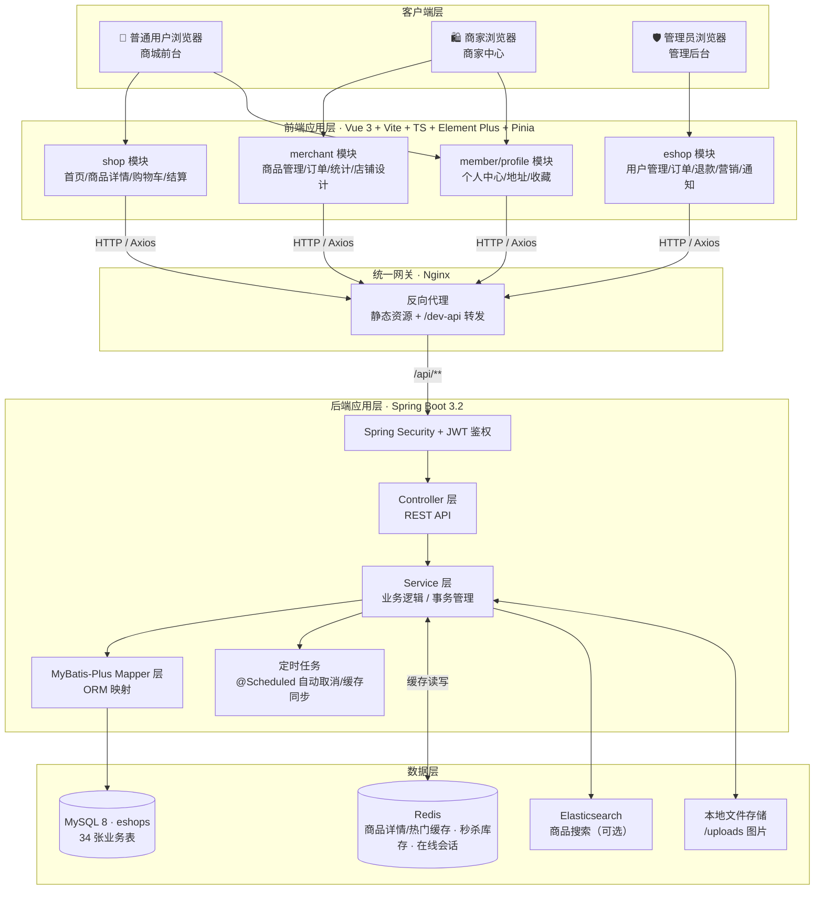

---

## 3. 数据库总览

34 张表按业务域划分为 **6 大体系**：

| 业务域 | 表名 | 用途 |
|---|---|---|
| **用户与店铺**（4） | `user` | 用户账号，角色 USER/MERCHANT/ADMIN |
| | `address` | 用户收货地址 |
| | `merchant_apply` | 商家入驻申请与审核 |
| | `store_design` | 商家店铺装修配置（1:1） |
| **商品**（8） | `category` | 商品分类（自关联树） |
| | `product` | 商品主表（库存/销量 = SKU 之和） |
| | `product_spec` | 商品规格维度定义（颜色/尺码等） |
| | `product_sku` | SKU 库存单元（独立价格/库存/销量） |
| | `product_size_chart` | 商品尺寸对照表（JSON） |
| | `product_image` | 商品图片相册 |
| | `product_comment` | 商品评论（支持楼中楼） |
| | `favorite` | 用户收藏 |
| **订单与购物车**（4） | `cart` | 购物车（支持 SKU 粒度） |
| | `order` | 订单主表 |
| | `order_shipment` | 发货单（按商家拆分） |
| | `order_item` | 订单明细（快照） |
| **营销**（8） | `coupon` | 优惠券模板 |
| | `user_coupon` | 用户持有优惠券 |
| | `seckill_session` | 秒杀场次 |
| | `promotion_activity` | 营销活动（签到/抽奖/任务） |
| | `festival_coupon_plan` | 节日优惠券活动计划 |
| | `user_activity_record` | 活动领取记录 |
| | `user_signin_record` | 用户签到记录 |
| | `user_signin_reward` | 签到达标奖励记录 |
| **退款与支付**（5） | `refund_application` | 退款申请（两级审核+执行） |
| | `refund_reason_category` | 退款原因分类字典 |
| | `refund_progress_log` | 退款处理节点日志 |
| | `refund_satisfaction` | 退款满意度评价 |
| | `payment_record` | 模拟支付流水 |
| **通知与日志**（5） | `sys_notice` | 系统通知（公告/订单/退款/留言） |
| | `sys_notice_read` | 通知已读记录 |
| | `merchant_message` | 用户向商家留言 |
| | `operation_log` | 后台操作审计日志 |
| | `visit_log` | 用户访问埋点日志 |

> 已废弃表：`merchant_notification`（已合并进 `sys_notice` 后 DROP）。

---

## 4. 全局 ER 关系总览

```mermaid
erDiagram
    %% ========== 用户与店铺域 ==========
    user ||--o{ address : "拥有"
    user ||--o{ merchant_apply : "提交入驻"
    user ||--o| store_design : "店铺配置(商家)"

    %% ========== 商品域 ==========
    category ||--o{ category : "父子分类"
    category ||--o{ product : "分类下"
    user ||--o{ product : "商家上架"
    product ||--o{ product_spec : "规格维度"
    product ||--o{ product_sku : "SKU单元"
    product ||--o| product_size_chart : "尺寸表"
    product ||--o{ product_image : "相册"
    product ||--o{ product_comment : "评论"
    user ||--o{ product_comment : "发表"
    product_comment ||--o{ product_comment : "楼中楼回复"
    user ||--o{ favorite : "收藏"
    product ||--o{ favorite : "被收藏"

    %% ========== 订单与购物车域 ==========
    user ||--o{ cart : "购物车"
    product ||--o{ cart : "加入"
    product_sku ||--o{ cart : "SKU选择"
    user ||--o{ order : "下单"
    order ||--o{ order_shipment : "按商家拆分"
    order ||--o{ order_item : "明细"
    order_shipment ||--o{ order_item : "履约单元"
    product ||--o{ order_item : "快照"

    %% ========== 营销域 ==========
    coupon ||--o{ user_coupon : "发放"
    user ||--o{ user_coupon : "领取"
    coupon ||--o{ seckill_session : "秒杀场次"
    coupon ||--o{ promotion_activity : "活动"
    coupon ||--o{ festival_coupon_plan : "节日计划"
    promotion_activity ||--o{ user_activity_record : "领取记录"
    user ||--o{ user_activity_record : "参与"
    user ||--o{ user_signin_record : "签到"
    user ||--o{ user_signin_reward : "签到奖励"

    %% ========== 退款与支付域 ==========
    order ||--o{ refund_application : "申请退款"
    user ||--o{ refund_application : "申请人"
    refund_reason_category ||--o{ refund_application : "原因分类"
    refund_application ||--o{ refund_progress_log : "进度日志"
    refund_application ||--o| refund_satisfaction : "满意度"
    order ||--o{ payment_record : "支付流水"
    user ||--o{ payment_record : "支付人"

    %% ========== 通知与日志域 ==========
    sys_notice ||--o{ sys_notice_read : "已读记录"
    user ||--o{ sys_notice_read : "阅读"
    user ||--o{ merchant_message : "留言(商家侧)"
    user ||--o{ merchant_message : "留言(用户侧)"
    product ||--o{ merchant_message : "关联商品"
    user ||--o{ operation_log : "操作审计"
    user ||--o{ visit_log : "访问埋点"
```

---

## 5. 业务域 ER 图与字段明细

### 5.1 用户与店铺域

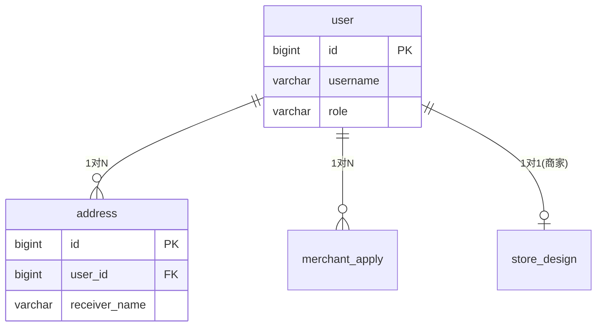

#### 5.1.1 user — 用户表

| 字段名 | 类型 | 允许空 | 默认值 | 说明 |
|---|---|---|---|---|
| **id** | bigint | NO | 自增 | 主键 |
| github_id | varchar(64) | YES | NULL | GitHub OAuth ID |
| username | varchar(50) | NO | — | 用户名（唯一） |
| nickname | varchar(50) | YES | NULL | 昵称 |
| password | varchar(255) | NO | — | 密码（BCrypt 加密） |
| phone | varchar(20) | YES | NULL | 手机号 |
| email | varchar(100) | YES | NULL | 邮箱 |
| avatar | varchar(500) | YES | NULL | 头像 URL |
| gender | tinyint | NO | 0 | 性别：0-未知 1-男 2-女 🔶后加 |
| status | tinyint | YES | 0 | 0-正常 1-冻结 |
| role | varchar(20) | NO | USER | 角色：USER / ADMIN / MERCHANT |
| create_time | datetime | YES | 当前时间 | 创建时间 |
| update_time | datetime | YES | 自动更新 | 更新时间 |
| deleted | tinyint | YES | 0 | 逻辑删除 |

> 索引：`UNIQUE uk_username(username)`、`UNIQUE uk_github_id(github_id)`

#### 5.1.2 address — 收货地址表

| 字段名 | 类型 | 允许空 | 默认值 | 说明 |
|---|---|---|---|---|
| **id** | bigint | NO | 自增 | 主键 |
| user_id | bigint | NO | — | 用户 ID |
| receiver_name | varchar(50) | NO | — | 收货人姓名 |
| receiver_phone | varchar(20) | NO | — | 收货人电话 |
| province | varchar(50) | YES | NULL | 省 |
| city | varchar(50) | YES | NULL | 市 |
| district | varchar(50) | YES | NULL | 区 |
| detail_address | varchar(200) | NO | — | 详细地址 |
| is_default | tinyint | YES | 0 | 0-非默认 1-默认 |
| create_time | datetime | YES | 当前时间 | 创建时间 |
| update_time | datetime | YES | 自动更新 | 更新时间 |

> 索引：`KEY idx_user(user_id)`

#### 5.1.3 merchant_apply — 商家入驻申请表

| 字段名 | 类型 | 允许空 | 默认值 | 说明 |
|---|---|---|---|---|
| **id** | bigint | NO | 自增 | 主键 |
| user_id | bigint | NO | — | 申请人用户 ID |
| business_name | varchar(100) | NO | — | 店铺名称 |
| business_license | varchar(500) | NO | — | 营业执照图片 URL |
| contact_name | varchar(50) | NO | — | 联系人姓名 |
| contact_phone | varchar(20) | NO | — | 联系人电话 |
| business_scope | varchar(500) | YES | NULL | 经营范围 |
| address | varchar(200) | YES | NULL | 经营地址 |
| status | tinyint | YES | 0 | 0-待审核 1-通过 2-拒绝 |
| remark | varchar(500) | YES | NULL | 审核备注（拒绝原因） |
| create_time | datetime | YES | 当前时间 | 创建时间 |
| update_time | datetime | YES | 自动更新 | 更新时间 |

> 索引：`KEY idx_user_id(user_id)`、`KEY idx_status(status)`

#### 5.1.4 store_design — 商家小店设计配置表

| 字段名 | 类型 | 允许空 | 默认值 | 说明 |
|---|---|---|---|---|
| **id** | bigint | NO | 自增 | 主键 |
| merchant_id | bigint | NO | — | 商家 ID（1:1，唯一） |
| background_color | varchar(20) | NO | '#667eea' | 店铺头背景色 |
| banner_url | varchar(500) | YES | NULL | 店铺头像 URL |
| create_time | datetime | YES | 当前时间 | 创建时间 |
| update_time | datetime | YES | 自动更新 | 更新时间 |

> 索引：`UNIQUE uk_merchant_id(merchant_id)`

---

### 5.2 商品域

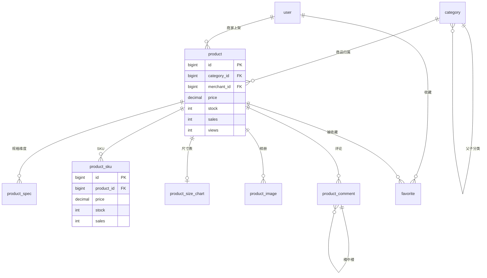

#### 5.2.1 category — 商品分类表

| 字段名 | 类型 | 允许空 | 默认值 | 说明 |
|---|---|---|---|---|
| **id** | bigint | NO | 自增 | 主键 |
| name | varchar(100) | NO | — | 分类名称 |
| parent_id | bigint | YES | 0 | 父分类 ID（0 为顶级） |
| level | tinyint | YES | 1 | 层级 |
| sort | int | YES | 0 | 排序 |
| status | tinyint | YES | 1 | 状态 |
| create_time | datetime | YES | 当前时间 | 创建时间 |
| update_time | datetime | YES | 自动更新 | 更新时间 |
| deleted | tinyint | YES | 0 | 逻辑删除 |

> 索引：`KEY idx_parent(parent_id)` — 自关联树形结构

#### 5.2.2 product — 商品主表

| 字段名 | 类型 | 允许空 | 默认值 | 说明 |
|---|---|---|---|---|
| **id** | bigint | NO | 自增 | 主键 |
| name | varchar(200) | NO | — | 商品名称 |
| name_pinyin | varchar(200) | YES | NULL | 商品名称全拼，用于拼音搜索 🔶后加 |
| category_id | bigint | YES | NULL | 分类 ID |
| merchant_id | bigint | NO | — | 商家 ID |
| price | decimal(10,2) | NO | — | 基础价格 |
| stock | int | NO | 0 | 库存（**= 所有 SKU 库存之和**，无规格时直接维护） |
| description | text | YES | NULL | 商品描述 |
| cover_image | varchar(500) | YES | NULL | 封面图 |
| status | tinyint | YES | 1 | 0-下架 1-上架 |
| create_time | datetime | YES | 当前时间 | 创建时间 |
| update_time | datetime | YES | 自动更新 | 更新时间 |
| deleted | tinyint | YES | 0 | 逻辑删除 |
| sales | int | YES | 0 | 销量（**= 所有 SKU 销量之和**，无规格时直接维护） |
| views | int | YES | 0 | 浏览量（Redis INCR 计数，每 5 分钟异步落库）🔶后加 |

> 索引：`KEY idx_category(category_id)`、`KEY idx_merchant(merchant_id)`、`KEY idx_status(status)`
> ⚠️ 一致性约束：有 SKU 的商品，`product.stock/sales` 与 `product_sku` 汇总值保持一致（下单/支付/退款/定时任务多路径同步）。

#### 5.2.3 product_spec — 商品规格定义表

| 字段名 | 类型 | 允许空 | 默认值 | 说明 |
|---|---|---|---|---|
| **id** | bigint | NO | 自增 | 主键 |
| product_id | bigint | NO | — | 商品 ID |
| spec_name | varchar(50) | NO | — | 规格名称（颜色/尺码/容量…） |
| spec_values | json | NO | — | 可选值列表，JSON 数组，如 `["红","蓝","黑"]` |
| sort_order | int | YES | 0 | 排序，小的在前 |

> 索引：`KEY idx_product(product_id)`
> ⚠️ 迁移文件 V20260729 中该字段定义为 `TEXT`，应用层按 JSON 字符串读写，二者可兼容。

#### 5.2.4 product_sku — 商品 SKU 库存单元表

| 字段名 | 类型 | 允许空 | 默认值 | 说明 |
|---|---|---|---|---|
| **id** | bigint | NO | 自增 | 主键 |
| product_id | bigint | NO | — | 商品 ID |
| specs | json | NO | — | 规格组合，JSON 键值对，如 `{"颜色":"雅丹黑","存储":"256GB"}` |
| price | decimal(10,2) | NO | — | 当前 SKU 售价 |
| stock | int | NO | 0 | 当前 SKU 库存 |
| sku_code | varchar(100) | YES | NULL | SKU 编码（系统生成或商户自定义） |
| image | varchar(500) | YES | NULL | SKU 专属图片（可选，为空用商品封面） |
| sales | int | YES | 0 | 该 SKU 销量 |

> 索引：`KEY idx_product(product_id)`
> ⚠️ 迁移文件 V20260729 中 `specs` 为 `TEXT`。

#### 5.2.5 product_size_chart — 商品尺寸对照表

| 字段名 | 类型 | 允许空 | 默认值 | 说明 |
|---|---|---|---|---|
| **id** | bigint | NO | 自增 | 主键 |
| product_id | bigint | NO | — | 商品 ID（1:1） |
| chart_title | varchar(100) | YES | '尺寸表' | 尺寸表标题 |
| columns_json | json | NO | — | 列头定义，JSON 数组 |
| rows_json | json | NO | — | 行数据，JSON 二维数组 |

> 索引：`UNIQUE uk_product(product_id)`（版本B迁移文件为普通索引，需确认实际库中生效版本）

#### 5.2.6 product_image — 商品图片表

| 字段名 | 类型 | 允许空 | 默认值 | 说明 |
|---|---|---|---|---|
| **id** | bigint | NO | 自增 | 主键 |
| product_id | bigint | NO | — | 商品 ID |
| image_url | varchar(500) | NO | — | 图片 URL |
| sort | int | YES | 0 | 排序 |

> 索引：`KEY idx_product(product_id)`

#### 5.2.7 product_comment — 商品评论表（支持楼中楼）

| 字段名 | 类型 | 允许空 | 默认值 | 说明 |
|---|---|---|---|---|
| **id** | bigint | NO | 自增 | 主键 |
| product_id | bigint | NO | — | 商品 ID |
| user_id | bigint | NO | — | 用户 ID |
| rating | tinyint | NO | 0 | 评分 1-5 |
| content | varchar(1000) | YES | NULL | 评论内容 |
| images | varchar(2000) | YES | NULL | 图片 URL 列表（JSON 数组） |
| status | tinyint | YES | 1 | 0-隐藏 1-正常 |
| parent_id | bigint | YES | 0 | 父评论 ID（0 为顶级），楼中楼 |
| reply_user_id | bigint | YES | NULL | 被回复的用户 ID |
| reply_content | varchar(500) | YES | NULL | 回复内容 |
| like_count | int | YES | 0 | 点赞数 |
| create_time | datetime | YES | 当前时间 | 创建时间 |
| update_time | datetime | YES | 自动更新 | 更新时间 |
| deleted | tinyint | YES | 0 | 逻辑删除 |

> 索引：`idx_product`、`idx_user`、`idx_parent`、`idx_status`、`idx_create_time`

#### 5.2.8 favorite — 用户收藏表

| 字段名 | 类型 | 允许空 | 默认值 | 说明 |
|---|---|---|---|---|
| **id** | bigint | NO | 自增 | 主键 |
| user_id | bigint | NO | — | 用户 ID |
| product_id | bigint | NO | — | 商品 ID |
| create_time | datetime | YES | 当前时间 | 创建时间 |

> 索引：`UNIQUE uk_user_product(user_id, product_id)`、`idx_user`、`idx_product` — 用户与商品多对多关系

---

### 5.3 订单与购物车域

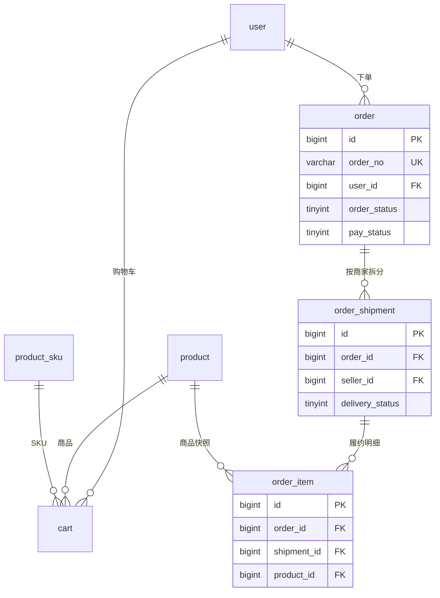

#### 5.3.1 cart — 购物车表

| 字段名 | 类型 | 允许空 | 默认值 | 说明 |
|---|---|---|---|---|
| **id** | bigint | NO | 自增 | 主键 |
| user_id | bigint | NO | — | 用户 ID |
| product_id | bigint | NO | — | 商品 ID |
| sku_id | bigint | YES | NULL | 选中的 SKU ID（无规格商品为 NULL）🔶后加 |
| sku_specs | varchar(500) | YES | NULL | SKU 规格描述，如"颜色:黑色, 尺码:41" 🔶后加 |
| quantity | int | NO | 1 | 数量 |
| selected | tinyint | YES | 1 | 是否勾选 |
| create_time | datetime | YES | 当前时间 | 创建时间 |
| update_time | datetime | YES | 自动更新 | 更新时间 |

> 索引：`UNIQUE uk_user_product_sku(user_id, product_id, sku_id)` — 原 `uk_user_product` 升级，支持同一商品不同 SKU 同时加入购物车

#### 5.3.2 order — 订单主表

| 字段名 | 类型 | 允许空 | 默认值 | 说明 |
|---|---|---|---|---|
| **id** | bigint | NO | 自增 | 主键 |
| order_no | varchar(32) | NO | — | 订单号（唯一） |
| user_id | bigint | NO | — | 下单用户 ID |
| total_amount | decimal(10,2) | NO | — | 订单总额 |
| pay_amount | decimal(10,2) | YES | NULL | 实付金额（抵扣优惠券后） |
| type | tinyint | YES | 1 | 订单类型 |
| pay_status | tinyint | YES | 0 | 支付状态：0-未支付 1-已支付 |
| order_status | tinyint | YES | 0 | 状态机见下表 |
| receiver_name | varchar(50) | YES | NULL | 收货人姓名 |
| receiver_phone | varchar(20) | NO | — | 收货人电话 |
| receiver_address | varchar(200) | NO | — | 收货地址（冗余） |
| remark | varchar(500) | YES | NULL | 订单备注 |
| create_time | datetime | YES | 当前时间 | 创建时间 |
| pay_time | datetime | YES | NULL | 支付时间 |
| finish_time | datetime | YES | NULL | 完成时间 |
| cancel_time | datetime | YES | NULL | 取消时间 |
| deleted | tinyint | YES | 0 | 逻辑删除 |

> 索引：`UNIQUE uk_order_no(order_no)`、`KEY idx_user(user_id)`
> 履约字段（delivery_status/time 等）已迁至 `order_shipment`。

**order_status 状态机（项目实际语义）：**

| 值 | 含义 | 说明 |
|---|---|---|
| 0 | 待付款 | 已创建未支付 |
| 1 | 待发货 | 已支付，等待商家发货 |
| 2 | 待收货 | 商家已发货 |
| 3 | 已完成 | 用户确认收货/自动确认 |
| 4 | 已取消 | 用户取消/超时自动取消 |
| 5 | 退款中 | 退款流程执行中 |
| 6 | 已退款 | 退款流程走完，订单作废（统计销售额时排除） |

#### 5.3.3 order_shipment — 发货单表（履约单元）

| 字段名 | 类型 | 允许空 | 默认值 | 说明 |
|---|---|---|---|---|
| **id** | bigint | NO | 自增 | 主键 |
| order_id | bigint | NO | — | 关联订单 ID |
| seller_id | bigint | NO | — | 商家 ID |
| delivery_status | tinyint | NO | 0 | 0-待发货 1-已发货 2-已收货 |
| shipping_name | varchar(50) | YES | NULL | 快递公司 |
| shipping_no | varchar(50) | YES | NULL | 快递单号 |
| shipping_time | datetime | YES | NULL | 发货时间 |
| received_time | datetime | YES | NULL | 收货时间 |
| total_amount | decimal(10,2) | NO | 0.00 | 本单商品总额 |
| create_time | datetime | YES | 当前时间 | 创建时间 |

> 索引：`KEY idx_order(order_id)`、`KEY idx_seller(seller_id)`
> 设计要点：一个订单包含多个商家的商品时，按商家拆分为多个发货单，各自独立发货、独立履约。

#### 5.3.4 order_item — 订单明细表

| 字段名 | 类型 | 允许空 | 默认值 | 说明 |
|---|---|---|---|---|
| **id** | bigint | NO | 自增 | 主键 |
| order_id | bigint | NO | — | 订单 ID |
| shipment_id | bigint | NO | — | 所属发货单 ID 🔶后加 |
| product_id | bigint | NO | — | 商品 ID |
| product_name | varchar(200) | NO | — | 商品名称（**下单快照**） |
| product_image | varchar(500) | YES | NULL | 商品图片（**下单快照**） |
| price | decimal(10,2) | NO | — | 成交单价（**快照**） |
| quantity | int | NO | — | 数量 |
| total_price | decimal(10,2) | NO | — | **生成列**：`price * quantity`（STORED），数据库自动计算 |

> 索引：`idx_order`、`idx_order_id`、`idx_shipment(shipment_id)`
> ⚠️ `total_price` 为 STORED 生成列，插入时无需也不能手工赋值。

---

### 5.4 营销域

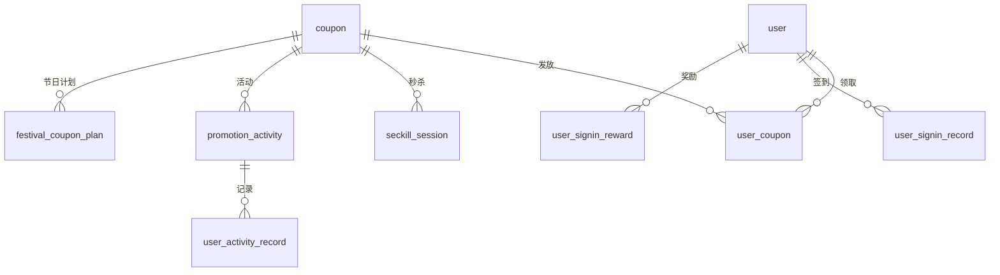

#### 5.4.1 coupon — 优惠券定义表

| 字段名 | 类型 | 允许空 | 默认值 | 说明 |
|---|---|---|---|---|
| **id** | bigint | NO | 自增 | 主键 |
| name | varchar(100) | NO | — | 优惠券名称 |
| type | tinyint | NO | 0 | 0-满减券 1-折扣券 |
| value | decimal(10,2) | NO | — | 面值 / 折扣率 |
| min_amount | decimal(10,2) | YES | 0.00 | 最低使用金额 |
| max_discount | decimal(10,2) | YES | NULL | 最高抵扣（折扣券） |
| stock | int | YES | 0 | 库存 |
| limit_per_user | int | YES | 1 | 每人限领 |
| start_time | datetime | YES | NULL | 生效时间 |
| end_time | datetime | YES | NULL | 失效时间 |
| status | tinyint | YES | 1 | 0-下架 1-上架 |
| description | varchar(500) | YES | NULL | 描述 |
| create_time | datetime | YES | 当前时间 | 创建时间 |
| update_time | datetime | YES | 自动更新 | 更新时间 |
| deleted | tinyint | YES | 0 | 逻辑删除 |
| obtain_type | tinyint | NO | 0 | 获取方式：0-普通领取 1-签到 2-新人礼包 3-秒杀 4-其他活动 🔶后加 |

> 索引：`idx_status`、`idx_time(start_time, end_time)`

#### 5.4.2 user_coupon — 用户优惠券表

| 字段名 | 类型 | 允许空 | 默认值 | 说明 |
|---|---|---|---|---|
| **id** | bigint | NO | 自增 | 主键 |
| user_id | bigint | NO | — | 用户 ID |
| coupon_id | bigint | NO | — | 优惠券 ID |
| order_no | varchar(50) | YES | NULL | 使用订单号 |
| status | tinyint | YES | 0 | 0-未使用 1-已使用 2-已过期 |
| get_time | datetime | YES | 当前时间 | 领取时间 |
| use_time | datetime | YES | NULL | 使用时间 |
| create_time | datetime | YES | 当前时间 | 创建时间 |
| update_time | datetime | YES | 自动更新 | 更新时间 |

> 索引：`idx_user`、`idx_coupon`、`idx_status`

#### 5.4.3 seckill_session — 秒杀场次表

| 字段名 | 类型 | 允许空 | 默认值 | 说明 |
|---|---|---|---|---|
| **id** | bigint | NO | 自增 | 主键 |
| coupon_id | bigint | NO | — | 关联优惠券 ID |
| session_name | varchar(100) | NO | — | 秒杀场次名称 |
| start_time | datetime | NO | — | 开始时间 |
| end_time | datetime | NO | — | 结束时间 |
| seckill_stock | int | NO | 0 | 秒杀独立库存 |
| limit_per_user | int | NO | 1 | 每人限领 |
| status | tinyint | NO | 0 | 0-待开始 1-进行中 2-已结束 3-已撤销 |
| create_time | datetime | YES | 当前时间 | 创建时间 |
| update_time | datetime | YES | 自动更新 | 更新时间 |
| deleted | tinyint | YES | 0 | 逻辑删除 |

> 索引：`idx_coupon_id`、`idx_status`、`idx_start_time`

#### 5.4.4 promotion_activity — 营销活动表

| 字段名 | 类型 | 允许空 | 默认值 | 说明 |
|---|---|---|---|---|
| **id** | bigint | NO | 自增 | 主键 |
| name | varchar(100) | NO | — | 活动名称 |
| type | tinyint | NO | — | 1-签到 2-抽奖 3-任务 4-限时抢券 |
| start_time | datetime | NO | — | 开始时间 |
| end_time | datetime | NO | — | 结束时间 |
| coupon_id | bigint | NO | — | 关联优惠券 ID |
| total_quota | int | YES | NULL | 总配额（NULL 不限） |
| daily_limit | int | YES | NULL | 每日领取限制（NULL 不限） |
| per_user_limit | int | YES | 1 | 每人总领取限制 |
| config | json | YES | NULL | 活动配置（签到天数、抽奖概率等） |
| status | tinyint | YES | 1 | 0-禁用 1-启用 |
| create_time | datetime | YES | 当前时间 | 创建时间 |

> 索引：`idx_coupon`、`idx_time(start_time, end_time)`

#### 5.4.5 festival_coupon_plan — 节日优惠券活动计划表

| 字段名 | 类型 | 允许空 | 默认值 | 说明 |
|---|---|---|---|---|
| **id** | bigint | NO | 自增 | 主键 |
| coupon_id | bigint | NO | — | 关联优惠券模板 ID |
| festival_name | varchar(50) | NO | — | 节日名称 |
| festival_icon | varchar(50) | YES | '🎉' | 节日图标（emoji） |
| start_date | date | NO | — | 活动开始日期 |
| end_date | date | NO | — | 活动结束日期 |
| required_signin_days | int | NO | 7 | 所需连续签到天数 |
| description | varchar(300) | YES | NULL | 活动描述文案 |
| status | tinyint | YES | 1 | 0-停用 1-启用 |
| create_time | datetime | YES | 当前时间 | 创建时间 |
| update_time | datetime | YES | 自动更新 | 更新时间 |

> 索引：`idx_coupon`、`idx_date(start_date, end_date)`、`idx_status`

#### 5.4.6 user_activity_record — 活动领取记录表

| 字段名 | 类型 | 允许空 | 默认值 | 说明 |
|---|---|---|---|---|
| **id** | bigint | NO | 自增 | 主键 |
| user_id | bigint | NO | — | 用户 ID |
| activity_id | bigint | NO | — | 活动 ID |
| coupon_id | bigint | NO | — | 领取的优惠券 ID |
| source | varchar(50) | YES | ACTIVITY | ACTIVITY-活动领取，SIGNIN-签到，LOTTERY-抽奖 |
| create_time | datetime | YES | 当前时间 | 创建时间 |

> 索引：`KEY idx_user_activity(user_id, activity_id)`

#### 5.4.7 user_signin_record — 用户签到记录表

| 字段名 | 类型 | 允许空 | 默认值 | 说明 |
|---|---|---|---|---|
| **id** | bigint | NO | 自增 | 主键 |
| user_id | bigint | NO | — | 用户 ID |
| sign_date | date | NO | — | 签到日期 |
| create_time | datetime | YES | 当前时间 | 创建时间 |

> 索引：`UNIQUE uk_user_date(user_id, sign_date)` — 防止同一天重复签到

#### 5.4.8 user_signin_reward — 签到奖励表

| 字段名 | 类型 | 允许空 | 默认值 | 说明 |
|---|---|---|---|---|
| **id** | bigint | NO | 自增 | 主键 |
| user_id | bigint | NO | — | 用户 ID |
| reward_type | tinyint | NO | — | 1-优惠券 |
| reward_id | bigint | NO | — | 优惠券模板 ID（→ coupon.id） |
| signin_consecutive_days | int | NO | — | 触发时的连续签到天数 |
| create_time | datetime | YES | 当前时间 | 创建时间 |

> 索引：`idx_user_id`

#### 5.4.9 group_buy_activity — 拼团活动表（2026-08-10 新增）

| 字段名 | 类型 | 允许空 | 默认值 | 说明 |
|---|---|---|---|---|
| **id** | bigint | NO | 自增 | 主键 |
| merchant_id | bigint | NO | — | 商家 ID（发布主体） |
| product_id | bigint | NO | — | 商品 ID |
| sku_id | bigint | YES | — | 绑定规格 SKU（方案A：单规格拼团，无规格商品为 NULL） |
| group_price | decimal(10,2) | NO | — | 拼团价 |
| target_count | int | NO | 2 | 成团人数（2~10） |
| duration_hours | int | NO | 24 | 拼团有效期（小时，开团后该团成团截止时间） |
| start_time | datetime | NO | — | 活动开始时间 |
| end_time | datetime | NO | — | 活动结束时间 |
| total_stock | int | NO | 0 | 活动可成团次数（成团时 `UPDATE ... AND total_stock >= 1` 原子扣减 1；下单不扣库存，避免开团占满库存导致他人无法参团） |
| sold_count | int | NO | 0 | 已成团份数 |
| status | tinyint | NO | 0 | 0草稿 1进行中 2已暂停 3已终止 |
| create_time | datetime | YES | 当前时间 | 创建时间 |
| update_time | datetime | YES | 自动 | 更新时间 |
| deleted | tinyint | NO | 0 | 逻辑删除 |

> 索引：`idx_product(product_id)`、`idx_merchant_status(merchant_id, status)`
> 发布主体：商家创建/编辑/启停；管理员仅查看/取消（`adminCancelActivity` 时对进行中团自动退款并通知）

#### 5.4.10 group_buy_group — 拼团团表（2026-08-10 新增）

| 字段名 | 类型 | 允许空 | 默认值 | 说明 |
|---|---|---|---|---|
| **id** | bigint | NO | 自增 | 主键 |
| activity_id | bigint | NO | — | 拼团活动 ID |
| group_no | varchar(32) | NO | — | 团号（展示用） |
| leader_id | bigint | NO | — | 开团用户 ID |
| status | tinyint | NO | 0 | 0拼团中 1已成团 2拼团失败已退款 3已取消 |
| expire_time | datetime | NO | — | 成团截止时间（开团时间 + duration_hours） |
| success_time | datetime | YES | — | 成团时间 |
| create_time | datetime | YES | 当前时间 | 创建时间 |
| update_time | datetime | YES | 自动 | 更新时间 |
| deleted | tinyint | NO | 0 | 逻辑删除 |

> 索引：`idx_activity_status(activity_id, status)`、`idx_leader(leader_id)`

#### 5.4.11 group_buy_member — 拼团成员表（2026-08-10 新增）

| 字段名 | 类型 | 允许空 | 默认值 | 说明 |
|---|---|---|---|---|
| **id** | bigint | NO | 自增 | 主键 |
| group_id | bigint | NO | — | 团 ID |
| user_id | bigint | NO | — | 用户 ID |
| order_id | bigint | NO | — | 拼团订单 ID（→ order.id，订单 type=2） |
| role | tinyint | NO | 0 | 1开团 0参团 |
| pay_status | tinyint | NO | 0 | 0待支付 1已支付（支付成功才计入成团人数） |
| create_time | datetime | YES | 当前时间 | 加入时间 |
| deleted | tinyint | NO | 0 | 逻辑删除 |

> 索引：`idx_group(group_id)`、`idx_user(user_id)`、`idx_order(order_id)`

---

### 5.5 退款与支付域

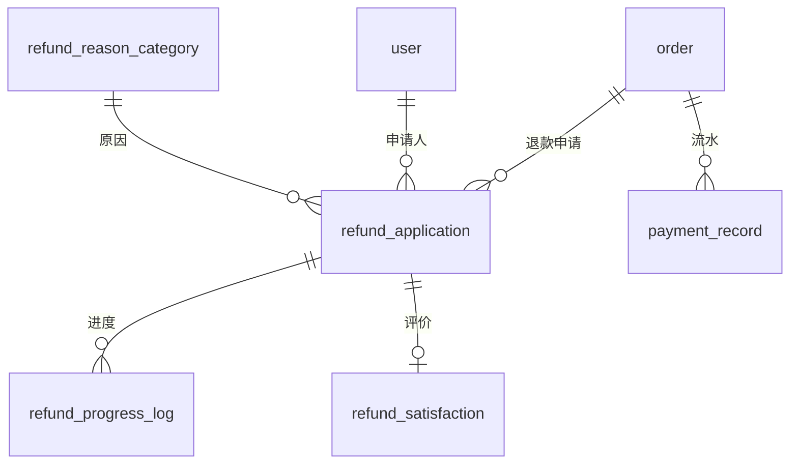

#### 5.5.1 refund_application — 退款申请表

| 字段名 | 类型 | 允许空 | 默认值 | 说明 |
|---|---|---|---|---|
| **id** | bigint | NO | 自增 | 主键 |
| order_id | bigint | NO | — | 订单 ID |
| user_id | bigint | NO | — | 申请人用户 ID |
| reason | varchar(200) | YES | NULL | 退款原因 |
| reason_category_id | bigint | YES | NULL | 退款原因分类 ID 🔶后加 |
| status | tinyint | YES | 0 | 状态机见下表 |
| remark | varchar(200) | YES | NULL | 审核备注（拒绝原因） |
| refund_amount | decimal(10,2) | NO | — | 退款金额（= 实付金额） |
| apply_time | datetime | YES | 当前时间 | 申请时间 |
| audit_time | datetime | YES | NULL | 审核时间 |
| merchant_audit_time | datetime | YES | NULL | 商户审核时间 🔶后加 |
| admin_audit_time | datetime | YES | NULL | 管理员审核时间 🔶后加 |
| refund_time | datetime | YES | NULL | 退款执行时间 🔶后加 |

> 索引：`idx_order_id`、`idx_user_id`、`idx_reason_category`

**status 状态机（两级审核 + 执行）：**

| 值 | 含义 | 说明 |
|---|---|---|
| 0 | 待商户审核 | 用户提交后 |
| 1 | 待管理员审核 | 商户初审通过 |
| 2 | 已通过 | 管理员审核通过 |
| 3 | 已拒绝 | 任一环节拒绝 |
| 4 | 退款执行中 | 系统执行退款 |
| 5 | 已退款 | 退款完成 |

#### 5.5.2 refund_reason_category — 退款原因分类表

| 字段名 | 类型 | 允许空 | 默认值 | 说明 |
|---|---|---|---|---|
| **id** | bigint | NO | 自增 | 主键 |
| name | varchar(100) | NO | — | 原因名称 |
| description | varchar(500) | YES | NULL | 原因描述 |
| sort | int | YES | 0 | 排序 |
| status | tinyint | YES | 1 | 0-禁用 1-启用 |

> ⚠️ 两个版本迁移脚本字段长度不同（varchar(100)/varchar(50)），需确认实际库中生效版本。

#### 5.5.3 refund_progress_log — 退款进度日志表

| 字段名 | 类型 | 允许空 | 默认值 | 说明 |
|---|---|---|---|---|
| **id** | bigint | NO | 自增 | 主键 |
| refund_id | bigint | NO | — | 退款申请 ID |
| node_name | varchar(100) | NO | — | 节点名称（如"提交申请""商户通过"） |
| operator | varchar(100) | YES | NULL | 操作人 |
| operator_role | varchar(20) | YES | NULL | 操作人角色 USER/MERCHANT/ADMIN |
| remark | varchar(500) | YES | NULL | 备注信息 |
| create_time | datetime | YES | 当前时间 | 创建时间 |

> 索引：`idx_refund_id`

#### 5.5.4 refund_satisfaction — 退款满意度反馈表

| 字段名 | 类型 | 允许空 | 默认值 | 说明 |
|---|---|---|---|---|
| **id** | bigint | NO | 自增 | 主键 |
| refund_id | bigint | NO | — | 退款申请 ID |
| user_id | bigint | NO | — | 用户 ID |
| rating | tinyint | NO | — | 评分 1-5 星 |
| feedback | varchar(500) | YES | NULL | 反馈内容 |
| create_time | datetime | YES | 当前时间 | 创建时间 |

> 索引：版本A `idx_refund_id`；版本B `UNIQUE uk_refund(refund_id)` + `idx_user`（一个退款只能评价一次）

#### 5.5.5 payment_record — 支付记录表（模拟支付）

| 字段名 | 类型 | 允许空 | 默认值 | 说明 |
|---|---|---|---|---|
| **id** | bigint | NO | 自增 | 主键 |
| order_id | bigint | NO | — | 订单 ID |
| order_no | varchar(64) | YES | NULL | 订单号 |
| user_id | bigint | NO | — | 用户 ID |
| amount | decimal(10,2) | NO | — | 支付金额 |
| pay_method | varchar(50) | YES | MOCK | 支付方式（版本B注释：wechat/alipay） |
| trade_no | varchar(100) | YES | NULL | 交易流水号 |
| status | tinyint | YES | 0 | 0-待支付 1-已支付 2-已退款 |
| pay_time | datetime | YES | NULL | 支付时间 |
| refund_time | datetime | YES | NULL | 退款时间 |

> 索引：`idx_order_id`、`idx_user_id`

---

### 5.6 通知与日志域

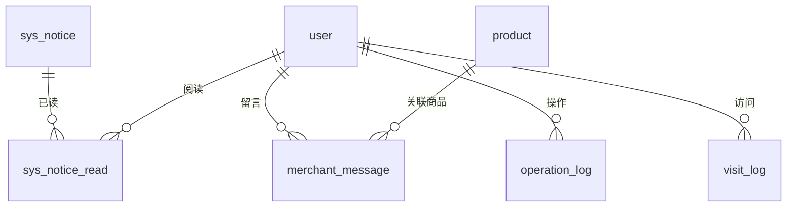

#### 5.6.1 sys_notice — 系统通知表

| 字段名 | 类型 | 允许空 | 默认值 | 说明 |
|---|---|---|---|---|
| **id** | bigint | NO | 自增 | 通知 ID |
| title | varchar(100) | NO | — | 通知标题 |
| type | tinyint | YES | 0 | 0-系统公告 1-活动通知 2-订单提醒 |
| level | tinyint | YES | 0 | 0-普通 1-重要 2-紧急 |
| target_type | tinyint | NO | 1 | 1-全体 2-指定用户 |
| target_user_ids | varchar(1000) | YES | NULL | 指定用户 ID，逗号分隔 |
| content | longtext | NO | — | 通知内容（HTML） |
| publisher_id | bigint | YES | NULL | 发布人 ID（→ user.id） |
| publisher_name | varchar(50) | YES | NULL | 发布人姓名 |
| publish_time | datetime | YES | 当前时间 | 发布时间 |
| revoke_time | datetime | YES | NULL | 撤回时间 |
| status | tinyint | YES | 0 | 0-草稿 1-已发布 2-已撤回 |
| create_time | datetime | YES | 当前时间 | 创建时间 |
| update_time | datetime | YES | 自动更新 | 更新时间 |
| biz_type | varchar(32) | YES | NULL | 业务类型：new_order / order_paid / order_cancelled / new_message / reply_message / refund_apply / refund_success 🔶后加 |
| biz_id | bigint | YES | NULL | 业务 ID（订单 ID / 留言 ID）🔶后加 |

> 索引：`idx_publish_time`
> 说明：已合并原 `merchant_notification` 表，通过 `biz_type`/`biz_id` 区分业务场景。

#### 5.6.2 sys_notice_read — 通知已读记录表

| 字段名 | 类型 | 允许空 | 默认值 | 说明 |
|---|---|---|---|---|
| **id** | bigint | NO | 自增 | 主键 |
| notice_id | bigint | NO | — | 通知 ID |
| user_id | bigint | NO | — | 用户 ID |
| read_time | datetime | YES | 当前时间 | 阅读时间 |

> 索引：`UNIQUE uk_notice_user(notice_id, user_id)` — 同一用户对同一通知只记一条

#### 5.6.3 merchant_message — 商家留言表

| 字段名 | 类型 | 允许空 | 默认值 | 说明 |
|---|---|---|---|---|
| **id** | bigint | NO | 自增 | 主键 |
| merchant_id | bigint | NO | — | 商家用户 ID |
| user_id | bigint | NO | — | 用户 ID |
| product_id | bigint | YES | NULL | 关联商品 ID |
| content | text | NO | — | 留言内容 |
| is_read | tinyint | YES | 0 | 是否已读：0-未读 1-已读 |
| create_time | datetime | YES | 当前时间 | 创建时间 |
| reply_content | text | YES | NULL | 商家回复 |
| reply_time | datetime | YES | NULL | 回复时间 |

> 索引：`KEY idx_merchant(merchant_id, is_read)`

#### 5.6.4 operation_log — 操作日志表（审计）

| 字段名 | 类型 | 允许空 | 默认值 | 说明 |
|---|---|---|---|---|
| **id** | bigint | NO | 自增 | 主键 |
| operator_id | bigint | NO | — | 操作人 ID（管理员） |
| operator_name | varchar(50) | YES | NULL | 操作人用户名 |
| operation_type | varchar(50) | NO | — | 操作类型（DELETE_PRODUCT / FREEZE_USER 等） |
| target_type | varchar(50) | YES | NULL | 目标类型（Product / User / Order 等） |
| target_id | bigint | YES | NULL | 目标 ID |
| content | varchar(500) | YES | NULL | 操作内容描述 |
| request_url | varchar(200) | YES | NULL | 请求 URL |
| request_params | text | YES | NULL | 请求参数（JSON） |
| ip | varchar(50) | YES | NULL | 操作 IP |
| user_agent | varchar(500) | YES | NULL | User-Agent |
| create_time | datetime | YES | 当前时间 | 创建时间 |

> 索引：`idx_operator_id`、`idx_operation_type`、`idx_create_time`

#### 5.6.5 visit_log — 用户访问日志表

| 字段名 | 类型 | 允许空 | 默认值 | 说明 |
|---|---|---|---|---|
| **id** | bigint | NO | 自增 | 主键 |
| user_id | bigint | YES | NULL | 用户 ID（未登录为 NULL） |
| ip | varchar(50) | YES | NULL | 访问 IP |
| user_agent | varchar(255) | YES | NULL | User-Agent |
| request_uri | varchar(255) | YES | NULL | 请求 URI |
| visit_time | datetime | NO | 当前时间 | 访问时间 |

> 索引：`idx_user_id`、`idx_visit_time`

---

## 6. 核心业务流程图

### 6.1 购物下单流程

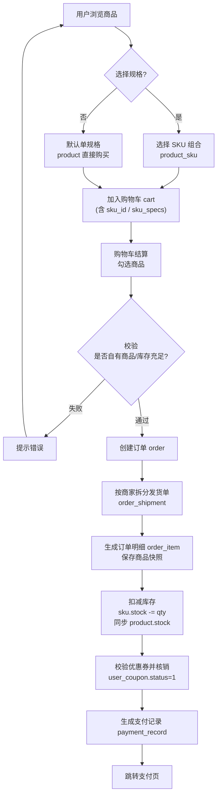

### 6.2 支付与数据一致性流程

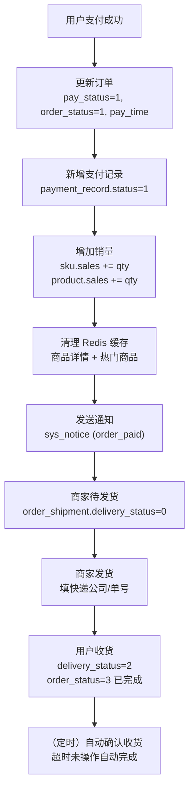

### 6.3 退款流程

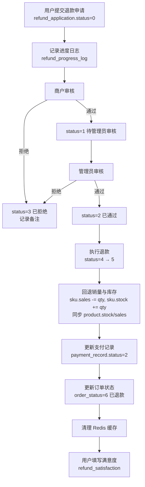

### 6.4 SKU 与主表数据一致性策略

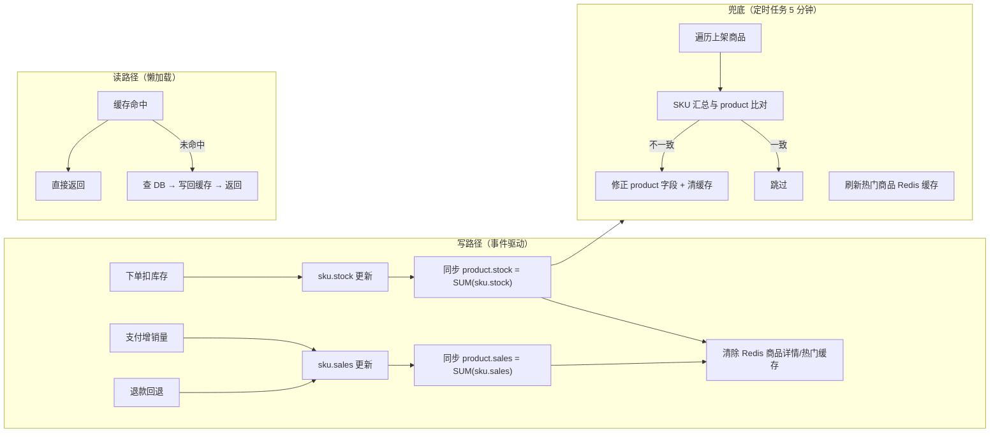

---

## 7. 通用设计约定

### 7.1 状态机汇总

| 表.字段 | 值 | 含义 |
|---|---|---|
| `order.order_status` | 0/1/2/3/4/5/6 | 待付款 / 待发货 / 待收货 / 已完成 / 已取消 / 退款中 / 已退款 |
| `order.pay_status` | 0/1 | 未支付 / 已支付 |
| `order_shipment.delivery_status` | 0/1/2 | 待发货 / 已发货 / 已收货 |
| `refund_application.status` | 0-5 | 待商户审核 / 待管理员审核 / 已通过 / 已拒绝 / 退款执行中 / 已退款 |
| `payment_record.status` | 0/1/2 | 待支付 / 已支付 / 已退款 |
| `user.status` | 0/1 | 正常 / 冻结 |
| `user.role` | — | USER / MERCHANT / ADMIN |
| `product.status` | 0/1 | 下架 / 上架 |
| `coupon.type` | 0/1 | 满减券 / 折扣券 |
| `merchant_apply.status` | 0/1/2 | 待审核 / 通过 / 拒绝 |
| `group_buy_activity.status` | 0/1/2/3 | 草稿 / 进行中 / 已暂停 / 已终止 |
| `group_buy_group.status` | 0/1/2/3 | 拼团中 / 已成团 / 拼团失败已退款 / 已取消 |
| `group_buy_member.role` | 0/1 | 参团 / 开团 |
| `group_buy_member.pay_status` | 0/1 | 待支付 / 已支付（计入成团人数） |

### 7.2 通用字段约定

| 字段 | 约定 |
|---|---|
| `id` | 所有表主键，bigint 自增 |
| `create_time` | 创建时间，默认 CURRENT_TIMESTAMP |
| `update_time` | 更新时间，ON UPDATE 自动刷新 |
| `deleted` | 逻辑删除，0 有效 / 1 删除（仅核心表） |
| `xxx_id` | 关联外键，由应用层维护（无物理外键约束） |

### 7.3 设计要点

1. **一单多商家模型**：`order` → `order_shipment`（按 seller_id 拆分）→ `order_item`，支持多商家合并付款、分开发货。
2. **SKU 与主表冗余**：`product.stock/sales` 为 SKU 汇总值，下单/支付/退款/定时任务四路径同步，Redis 缓存写后失效；`product.views` 为 Redis INCR 原子计数，每 5 分钟批量异步落库（高频写不直连 DB，避免写放大）。
3. **订单快照**：`order_item` 冗余商品名/图片/单价，`order` 冗余收货人/地址，防止后续变更影响历史数据。
4. **JSON 场景**：规格值（`product_spec.spec_values`）、SKU 组合（`product_sku.specs`）、活动配置（`promotion_activity.config`）、尺寸表（`product_size_chart.*_json`）均以 JSON 存储，结构灵活。
5. **生成列**：`order_item.total_price = price * quantity` 为 STORED 生成列，数据库自动计算，避免应用层计算不一致。
6. **防重复设计**：`user_signin_record` 唯一键（user_id, sign_date）防重复签到；`sys_notice_read` 唯一键（notice_id, user_id）防重复已读；`favorite` 唯一键（user_id, product_id）防重复收藏。

---

## 8. 版本差异说明

以下表存在**多个建表脚本版本冲突**，文档采用主导出文件 `eshops.sql`（2026-07-23）为基准，迁移脚本差异如下：

| 表 | 差异点 | 涉及文件 |
|---|---|---|
| `product_size_chart` | JSON + UNIQUE vs TEXT + 普通索引 | `size_chart.sql` vs `V20260729__create_product_spec_sku_sizechart.sql` |
| `product_spec.spec_values` / `product_sku.specs` | JSON vs TEXT | `eshops.sql` vs `V20260729` |
| `refund_reason_category` | name varchar(100)/description varchar(500) vs varchar(50)/varchar(200)；种子数据不同 | 两个 V20260724 脚本 |
| `refund_progress_log` | operator/operator_role 可空 vs NOT NULL | 同上 |
| `refund_satisfaction` | 普通索引 vs UNIQUE + idx_user | 同上 |
| `payment_record` | 字段长度、order_no 可空性、pay_method 默认值、索引名 | 同上 |
| `refund_application` | `idx_reason_category` 仅一个版本添加 | 同上 |
| `cart.sku_specs` | varchar(500) vs varchar(200) | `cart_sku.sql` vs `V20260729` |
| `festival_coupon_plan` | 字段长度/默认值差异 | `eshops.sql` vs `V20260724__create_festival_coupon_plan.sql` |
| `product.name_pinyin` | varchar(200) NULL vs varchar(1000) DEFAULT '' | `eshops.sql` vs `migration_add_pinyin.sql` |
| `product.views` | 2026-08-10 新增浏览量列（`ALTER TABLE product ADD COLUMN views INT NOT NULL DEFAULT 0`，无迁移脚本，手动执行） | 手动迁移 |
| `group_buy_activity` / `group_buy_group` / `group_buy_member` | 2026-08-10 新增拼团 3 张表（方案A：绑定单规格） | `V20260810__create_group_buy.sql` |

> 建议：以生产库 `SHOW CREATE TABLE` 的导出结果为准，若存在冲突请以实际运行的 Flyway 迁移链（`V2026*`）最终状态为准。

---

*文档结束。* 生成依据：`sql/eshops.sql` + 13 个迁移脚本 + 后端 Entity/Mapper 代码。
