# 毕设报告

> 根据《附件15：计算机科学与软件学院2026届毕业设计(论文)参考模板（2025年9月）》与《附件7：计算机科学与软件学院本科生毕业论文（设计）写作与印制规范（2025年9月）》生成。
> 其中封面、原创性声明、版权使用授权书等个人信息请按实际填写；转 Word 后请在目录处右键"更新域"生成页码。

---

## 封面

**论文题目：基于Spring Boot与Vue3的B2B2C电商购物系统的设计与实现**

| 项目 | 内容 |
| --- | --- |
| 学院 | 计算机科学与软件学院 |
| 专业 | 软件工程 |
| 年级 | 2023级 |
| 学号 | 202324113109 |
| 学生姓名 | 吴树鑫 |
| 指导教师 | 王建彬 |
| 完成时间 | 2026 年 8 月 |

---

## 毕业论文（设计）原创性声明

郑重声明：所呈交的毕业论文（设计）是本人在导师的指导下，独立进行研究取得的成果。除文中已经注明引用的内容外，本论文（设计）不包括其他个人或集体已经发表或撰写过的作品成果。对本文的研究做出贡献的个人和集体，均已在文中以明确方式标明。本人完全意识到本声明的法律后果，并承诺因本声明而产生的法律结果由本人承担。

论文作者：电子签名
日期：    年    月    日

---

## 毕业论文（设计）版权使用授权书

本毕业论文（设计）作者完全了解学校有关保留、使用毕业论文（设计）的规定，同意学校保留并向国家有关部门或机构送交论文（设计）的复印件和电子版，允许论文（设计）被查阅和借阅。本人授权肇庆学院将本论文（设计）的全部或部分内容编入有关数据库进行检索，可以采用影印、缩印或扫描等复制手段保存和汇编本论文（设计）。

论文作者签名：电子签名　　　　指导教师签名：电子签名
日期：    年    月    日　　　　日期：    年    月    日

---

<div style="page-break-after: always;"></div>

## 目  录

1 引言
　1.1 课题背景及意义
　1.2 国内外研究现状
　1.3 研究内容
　1.4 论文组织结构
2 系统需求分析与总体设计
　2.1 系统需求分析
　2.2 系统总体架构
　2.3 技术选型
　2.4 数据库设计
　2.5 系统功能模块设计
3 系统详细设计与实现
　3.1 用户认证与权限管理模块
　3.2 商品管理模块
　3.3 购物车与订单模块
　3.4 支付模块
　3.5 秒杀模块
　3.6 优惠券与营销活动模块
　3.7 AI智能服务模块
　3.8 前端实现
4 系统测试与问题整改
　4.1 测试环境
　4.2 功能测试
　4.3 安全测试
　4.4 并发与一致性测试
　4.5 前端构建与类型检查
　4.6 整改效果分析
5 总结与展望
　5.1 总结
　5.2 不足与展望
参考文献
致  谢
附录A　系统部分界面展示
附录B　数据库表清单

## 图表目录

- 图2-1 系统总体架构图
- 图2-2 核心业务实体关系（E-R）图
- 图2-3 商品业务域E-R图
- 图2-4 订单与支付退款业务域E-R图
- 图2-5 营销与拼团业务域E-R图
- 图2-6 系统功能模块图
- 图2-7 后端分层架构类图（以订单模块为例）
- 图3-1 用户认证与请求鉴权流程图
- 图3-2 商品搜索降级流程图
- 图3-3 订单创建流程图
- 图3-4 退款申请与审核流程图
- 图3-5 支付与对账自愈时序图
- 图3-6 秒杀分层拦截漏斗示意图
- 图3-7 秒杀模块核心类图
- 图3-8 拼团状态机图
- 图3-9 RAG检索增强问答流程图
- 图3-10 AI工具调用时序图
- 图3-11 AI智能服务类图
- 图4-1 秒杀链路吞吐量压测对比图
- 图4-2 秒杀链路P99延迟压测对比图
- 图4-3 访问日志异步发送改造设计图
- 表2-1 三类角色功能需求一览表
- 表2-2 系统主要技术选型表
- 表2-3 数据库表按业务域分类统计表
- 表4-1 系统测试环境表
- 表4-2 核心功能测试用例表
- 表4-3 安全测试用例表
- 表4-4 并发与一致性测试用例表
- 表4-5 秒杀链路压测结果对比表
- 表4-6 主要整改问题清单表

---

<div style="page-break-after: always;"></div>

## 基于Spring Boot与Vue3的B2B2C电商购物系统的设计与实现

**摘  要：** 随着电子商务市场扩大，传统单商家商城难以满足多商家入驻与多角色协同的需求。本文设计并实现了前后端分离的B2B2C电商购物系统，后端基于Spring Boot，数据层采用MySQL、Redis与Elasticsearch，前端基于Vue 3，支持用户、商家与管理员三类角色，数据库含40张业务表。系统重点解决三方面问题：一是接入支付宝沙箱实现真实支付闭环，并针对异步回调丢失设计基于查单接口的对账自愈机制；二是采用分层拦截漏斗与事务边界收窄治理秒杀高并发，经压测吞吐量提升68%、P99延迟下降93%，且零超卖；三是基于独立Python服务对接通义千问大模型，实现RAG检索增强智能客服与防幻觉拒答。系统还针对权限失效、越权访问与并发超卖等问题完成整改，经测试验证了功能完整性与数据一致性，运行稳定，可为同类系统开发提供参考。

**关键词：** 电子商务；B2B2C；Spring Boot；Vue3；秒杀

---

## Design and Implementation of B2B2C E-commerce Shopping System Based on Spring Boot and Vue3

**Abstract:** With the expansion of the e-commerce market, traditional single-merchant platforms can hardly meet the requirements of multi-merchant access and multi-role collaboration. This thesis designs and implements a front-end and back-end separated B2B2C e-commerce shopping system. The back end is built on Spring Boot, the data layer adopts MySQL, Redis and Elasticsearch, and the front end is based on Vue 3. The system supports three roles including users, merchants and administrators, with 40 database tables. It focuses on solving three problems: first, it integrates the Alipay sandbox to realize a real payment closed loop, and designs a reconciliation self-healing mechanism based on the trade query API for the case of lost asynchronous callbacks; second, it adopts a layered interception funnel and narrowed transaction boundaries to govern seckill concurrency, and the stress test shows a throughput increase of 68% and a P99 latency decrease of 93% with zero overselling; third, it implements a RAG-enhanced intelligent customer service with anti-hallucination refusal based on an independent Python service connected to the Qwen large language model. In addition, the system completes rectification for problems such as invalid permissions, unauthorized access and concurrent overselling, and tests verify its functional integrity and data consistency. The system runs stably and can provide a reference for the development of similar systems.

**Key words:** E-commerce; B2B2C; Spring Boot; Vue3; Seckill

---

<div style="page-break-after: always;"></div>

## 1 引言

### 1.1 课题背景及意义

近年来，电子商务已经成为社会经济运行的重要组成部分。随着网络购物用户规模持续增长，越来越多的中小商家希望以较低成本入驻线上平台，面向消费者开展商品销售和营销活动。B2B2C（Business to Business to Consumer）模式将平台、商家和消费者连接在一起：平台为商家提供店铺、商品、订单、营销等基础设施，商家直接面向消费者提供商品和服务，消费者则获得更加丰富的商品选择和购物体验。淘宝、京东、拼多多等主流平台的成功充分证明了这一模式的生命力。

当前许多教学实践项目仍停留在简单的单商家商城或仅具备基础CRUD功能的层面，缺乏对多角色权限、复杂订单流程、高并发营销场景、真实支付链路的完整考虑。而工业级电商系统所面临的核心挑战——并发扣减不超卖、支付最终一致性、缓存与数据库一致性、外部依赖故障降级、越权访问防护——恰恰是软件工程能力训练中最有价值的部分。因此，设计并实现一个功能完整、结构清晰、具有一定工程质量的B2B2C电商系统，不仅能够提升开发者对前后端分离架构、数据库设计、缓存使用、并发控制和系统安全的理解，也能为中小型电商平台的建设提供可参考的实现方案。

本课题以毕业设计为背景，综合运用Spring Boot、Vue3、MySQL、Redis等主流技术，完成了一个包含用户商城、商家中心、管理后台三端的B2B2C电商购物系统，并独立扩展了支付宝真实支付、秒杀高并发治理与压测优化、AI智能服务（RAG检索增强客服）等具有区分度的技术实践。系统在实现基本电商业务的同时，重点解决了权限控制、并发扣减、缓存使用、支付一致性和系统测试等方面的问题，具有一定的理论意义和应用价值。

### 1.2 国内外研究现状

国外电子商务发展较早，Amazon、eBay等平台形成了成熟的商品、订单、支付和推荐体系。国内电商领域，淘宝、京东、拼多多分别代表了综合平台、自营平台和社交电商等不同模式，其技术架构普遍经历了从单体应用到微服务化、容器化部署的演进过程。在系统支撑技术方面，各大平台公开的技术实践（如库存扣减的原子操作、秒杀流量漏斗式拦截、异步消息削峰、热点数据多级缓存）已成为行业共识，为中小型电商系统的设计提供了成熟范式。

在技术研究方面，Spring Boot以其自动配置、快速开发和生态完善的特点，成为Java后端开发的主流框架；Vue3结合TypeScript和Vite，为前端工程化开发提供了良好的开发体验；Redis凭借高性能数据结构和原子操作能力，被广泛应用于缓存、分布式锁、秒杀等场景；Elasticsearch则为商品搜索提供了全文检索和高亮展示能力。近年来，随着大语言模型（LLM）技术的发展，检索增强生成（Retrieval-Augmented Generation，RAG）通过"先检索知识库、再生成回答"的方式显著缓解了模型幻觉问题，将AI能力接入电商客服系统已成为提升用户体验的重要方向，Function Calling（工具调用）技术则使模型能够查询实时业务数据后作答，进一步提高了回答的准确性与实用性。

从现有资料看，电商系统的相关文献较多，但多数侧重于某个单一模块或算法优化，完整覆盖多角色电商业务、真实支付链路、并发安全整改、AI能力接入和自动化测试的毕业设计案例仍然较少。本课题在实现完整业务闭环的基础上，重点对系统安全、并发一致性、支付最终一致性和测试验证进行深入实践。

### 1.3 研究内容

本课题主要研究内容如下：

（1）完成B2B2C电商系统的需求分析，明确普通用户、商家、管理员三类角色的功能边界，设计系统总体架构和包含40张业务表的数据库结构。

（2）实现用户注册登录、JWT认证、RBAC权限控制、邮箱绑定与密码重置等用户模块功能，解决方法级安全失效、越权访问等安全问题。

（3）实现商品分类、商品信息、SKU库存、商品图片、商品评论、收藏、搜索等功能，并支持无Elasticsearch环境下自动降级为MySQL查询；在商品详情页提供基于分类与店铺维度的零埋点关联推荐。

（4）实现购物车、订单创建、支付宝沙箱支付、商家发货、确认收货、退款申请与审核等核心交易流程，通过数据库条件UPDATE解决并发下单场景下的库存超卖问题；针对支付异步回调可能丢失的情况，设计基于支付宝查单接口的对账自愈机制，保证支付最终一致。

（5）实现优惠券领取与使用、秒杀活动（优惠券秒杀与商品秒杀两种模式）、拼团活动、签到和通用任务制营销活动等营销功能，采用Redis Lua原子脚本、事务边界收窄、分层拦截漏斗等手段治理秒杀高并发场景，并通过JMeter压力测试验证优化效果。

（6）设计并实现AI智能服务模块，以独立Python FastAPI服务对接通义千问大模型：智能客服结合RAG知识库检索与工具调用回答用户问题，并在检索不到依据时拒答以防幻觉；同时提供商品文案生成与评论情感分析能力。

（7）对系统进行安全审查和测试，针对发现的30余项问题进行专项整改；对秒杀核心链路进行JMeter压力测试与性能优化（吞吐量提升68%、P99延迟下降93%）；针对测试数据污染编写幂等对账脚本完成全库数据一致性治理。

### 1.4 论文组织结构

本文共分为五章，各章内容安排如下：

第一章为引言，介绍课题背景、研究意义、国内外研究现状和本文主要研究内容。

第二章为系统需求分析与总体设计，阐述系统功能需求、非功能需求、总体架构、技术选型、数据库设计和功能模块划分。

第三章为系统详细设计与实现，按模块介绍用户认证、商品、购物车与订单、支付、秒杀、营销活动、AI智能服务和前端实现的关键技术与设计方案。

第四章为系统测试与问题整改，说明测试环境、功能测试、安全测试、并发与一致性测试、压测结果以及整改效果分析。

第五章为总结与展望，总结本文工作，分析系统不足并提出后续改进方向。

---

<div style="page-break-after: always;"></div>

## 2 系统需求分析与总体设计

### 2.1 系统需求分析

#### 2.1.1 功能需求

本系统面向三类用户角色，采用B2B2C经营模式：平台提供基础设施并负责监管审核，商家入驻开设店铺面向消费者销售商品，消费者完成购物全流程。三类角色的主要功能需求如表2-1所示。

表2-1 三类角色功能需求一览表

| 角色 | 功能需求 |
| --- | --- |
| 普通用户（USER） | 注册登录、浏览商品、搜索筛选、查看详情与关联推荐、加入购物车、提交订单、支付宝在线支付、查看订单、申请退款、领取优惠券、参与秒杀、参与拼团、每日签到、参与营销活动、收藏商品、浏览历史、发表评论、管理收货地址、使用AI客服咨询 |
| 商家（MERCHANT） | 申请入驻、店铺信息与装修、商品与SKU管理、AI辅助生成商品文案、富文本介绍编辑与提交审核、创建拼团活动、订单发货管理、退款初审、经营统计、系统通知与用户留言 |
| 平台管理员（ADMIN） | 用户管理、商家入驻审核、分类与商品管理、优惠券与秒杀场次管理、营销活动管理、退款终审、商品介绍审核、AI辅助评论情感分析、系统通知、数据统计、操作日志查询 |

#### 2.1.2 非功能需求

系统除满足基本业务功能外，还需要满足以下非功能需求：

（1）安全性：采用JWT进行身份认证，方法级权限控制管理接口；文件上传需要登录并校验类型白名单；用户敏感操作需要归属校验和验证码校验；验证码一次性有效，防止重放。

（2）并发性：在秒杀、领券、下单等场景下，需要保证库存不超卖、优惠券不超发，数据最终一致；被拒绝的无效请求不应挤占数据库连接等核心资源。

（3）稳定性：商品搜索在Elasticsearch不可用时应自动降级为MySQL查询；外部支付回调丢失时系统应能主动对账自愈，不影响核心业务流程。

（4）可维护性：后端采用Controller-Service-Mapper分层架构，统一异常处理与错误码规范；前端按业务域组织API和页面，统一封装请求和错误处理，便于后续维护和扩展。

（5）性能：商品详情、热门商品、分类树、秒杀场次等热点数据使用多级缓存（本地缓存+Redis）降低数据库压力；高频访问页面采用组件缓存提升前端访问体验。

### 2.2 系统总体架构

系统采用前后端分离的单体应用架构。前端为Vue3单页应用，通过Axios访问后端REST API；后端为Spring Boot单体应用，按Controller、Service、Mapper三层组织；数据层使用MySQL存储业务数据、Redis提供缓存和并发控制、Elasticsearch提供商品搜索能力；支付能力通过支付宝沙箱开放平台接入；AI智能服务作为独立Python服务旁路运行，与Java业务系统通过HTTP接口解耦。系统总体架构如图2-1所示。

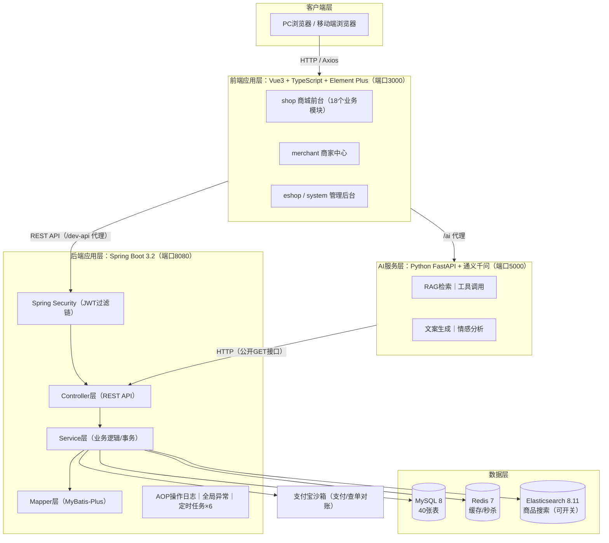
```mermaid
graph TB
    subgraph Client["客户端层"]
        C1["PC浏览器 / 移动端浏览器"]
    end
    subgraph FE["前端应用层：Vue3 + TypeScript + Element Plus（端口3000）"]
        F1["shop 商城前台（18个业务模块）"]
        F2["merchant 商家中心"]
        F3["eshop / system 管理后台"]
    end
    subgraph BE["后端应用层：Spring Boot 3.2（端口8080）"]
        B0["Spring Security（JWT过滤链）"]
        B1["Controller层（REST API）"]
        B2["Service层（业务逻辑/事务）"]
        B3["Mapper层（MyBatis-Plus）"]
        B4["AOP操作日志｜全局异常｜定时任务×6"]
    end
    subgraph AI["AI服务层：Python FastAPI + 通义千问（端口5000）"]
        A1["RAG检索｜工具调用"]
        A2["文案生成｜情感分析"]
    end
    subgraph Data["数据层"]
        D1[("MySQL 8<br/>40张表")]
        D2[("Redis 7<br/>缓存/秒杀")]
        D3[("Elasticsearch 8.11<br/>商品搜索（可开关）")]
    end
    PAY["支付宝沙箱（支付/查单对账）"]
    C1 -->|"HTTP / Axios"| FE
    FE -->|"REST API（/dev-api 代理）"| B0
    FE -->|"/ai 代理"| AI
    B0 --> B1 --> B2 --> B3
    B2 --> D1
    B2 --> D2
    B2 --> D3
    B2 --> PAY
    AI -->|"HTTP（公开GET接口）"| B1
```

图2-1 系统总体架构图

架构设计上有三点考虑：其一，AI服务独立部署而非嵌入Java应用，避免Python依赖污染Java技术栈，且AI服务故障不影响核心交易链路；其二，前端通过Nginx/Vite代理统一访问后端与AI服务，生产环境前端静态资源与`/prod-api`、`/ai`路径均由Nginx分发，实现部署层面的解耦；其三，Elasticsearch设计为可配置开关（`elasticsearch.enabled`），关闭时自动降级MySQL查询，保证搜索功能不因外部依赖故障而完全不可用。

### 2.3 技术选型

系统主要技术选型如表2-2所示。选型总体原则是：采用社区活跃、文档完善的 mainstream 技术栈，保证开发效率与可维护性；同时在关键场景（缓存原子操作、搜索、支付、AI）选用经过工业验证的专用组件。

表2-2 系统主要技术选型表

| 层次 | 技术 | 版本 | 说明 |
| --- | --- | --- | --- |
| 后端框架 | Spring Boot | 3.2.2 | 自动配置、快速开发，内嵌Tomcat |
| 安全认证 | Spring Security + JWT（jjwt） | 6.x | 无状态登录认证与方法级权限控制 |
| ORM | MyBatis-Plus | 3.5.6 | 简化数据访问，支持分页和逻辑删除 |
| 数据库 | MySQL | 8.0 | 业务数据存储，40张表，InnoDB |
| 缓存 | Redis | 7 | 热点缓存、验证码、秒杀库存、分布式计数 |
| 搜索 | Elasticsearch | 8.11 | 商品全文搜索，配置开关+自动降级 |
| 消息队列 | RabbitMQ | 3.x | 订单超时取消（延迟消息）、异步通知 |
| 支付 | 支付宝沙箱（alipay-sdk） | — | 在线支付、异步回调与查单对账 |
| 前端框架 | Vue 3 + TypeScript | 3.5 | 组合式API构建单页应用 |
| UI组件 | Element Plus | 2.13 | 桌面端组件库，配合暗色模式 |
| 状态管理 | Pinia | 3.x | 用户、购物车、标签页等模块状态 |
| 构建工具 | Vite | 8 | 开发服务器与生产构建 |
| AI服务 | Python FastAPI + 通义千问 | 3.12 | RAG客服、文案生成、评论情感分析 |
| 压测工具 | Apache JMeter | 5.6.3 | 秒杀链路压力测试 |

### 2.4 数据库设计

系统数据库采用MySQL 8（InnoDB引擎，utf8mb4字符集），数据库名为eshops，共包含40张业务表。数据库设计遵循以下原则：不使用物理外键，关联关系由应用层维护，便于分库分表演进；核心表采用逻辑删除（deleted字段）；规格值、活动配置等半结构化数据以JSON字段存储；订单明细保存商品名称、价格、图片等快照信息，防止商品后续修改影响历史订单。

40张表按业务域划分为七大类，如表2-3所示。

表2-3 数据库表按业务域分类统计表

| 业务域 | 表数量 | 主要表 | 用途 |
| --- | --- | --- | --- |
| 用户与店铺 | 4 | user、address、merchant_apply、store_design | 账号、地址、入驻申请、店铺装修 |
| 商品 | 9 | product、product_sku、product_spec、category等 | 商品、SKU、规格、评论、收藏 |
| 订单与购物车 | 4 | order、order_item、order_shipment、cart | 订单主表、明细快照、按商家拆分的发货单 |
| 营销 | 13 | coupon、user_coupon、seckill_session、marketing_activity、marketing_task等 | 优惠券、秒杀、签到、任务制活动 |
| 拼团 | 3 | group_buy_activity、group_buy_group、group_buy_member | 拼团活动、团、团员 |
| 退款与支付 | 5 | refund_application系列、payment_transaction | 退款流程、支付宝支付流水 |
| 通知与日志 | 5 | sys_notice、operation_log、visit_log等 | 系统通知、操作日志、访问埋点 |

核心业务实体关系如图2-2所示。

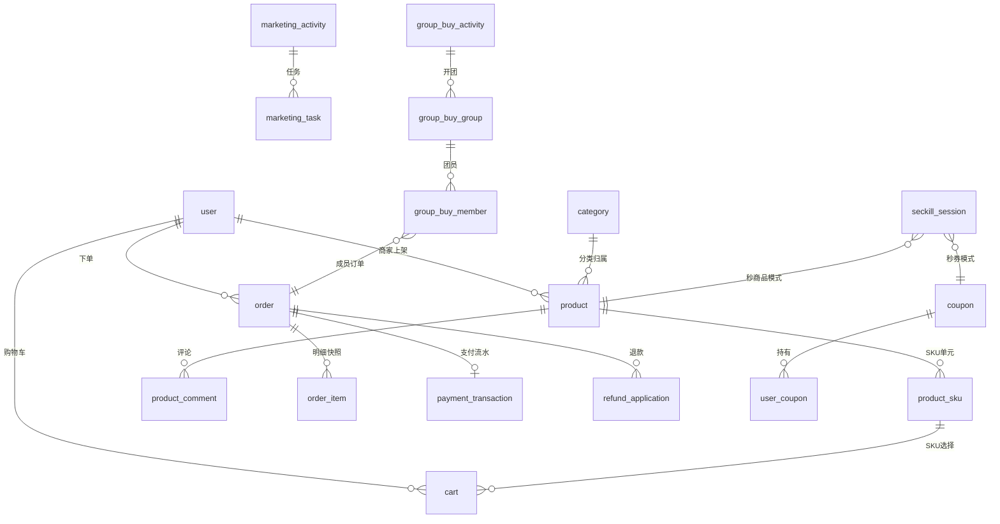
```mermaid
erDiagram
    user ||--o{ product : "商家上架"
    category ||--o{ product : "分类归属"
    product ||--o{ product_sku : "SKU单元"
    product ||--o{ product_comment : "评论"
    user ||--o{ cart : "购物车"
    product_sku ||--o{ cart : "SKU选择"
    user ||--o{ order : "下单"
    order ||--o{ order_item : "明细快照"
    order ||--o| payment_transaction : "支付流水"
    order ||--o{ refund_application : "退款"
    coupon ||--o{ user_coupon : "持有"
    seckill_session }o--|| coupon : "秒券模式"
    seckill_session }o--|| product : "秒商品模式"
    marketing_activity ||--o{ marketing_task : "任务"
    group_buy_activity ||--o{ group_buy_group : "开团"
    group_buy_group ||--o{ group_buy_member : "团员"
    group_buy_member }o--|| order : "成员订单"
```

图2-2 核心业务实体关系（E-R）图

在全局E-R图基础上，进一步给出各业务域的细化E-R设计。商品业务域围绕"分类—商品—SKU—规格—评论"组织，商品维度的库存与销量始终由SKU汇总维护，E-R设计如图2-3所示。

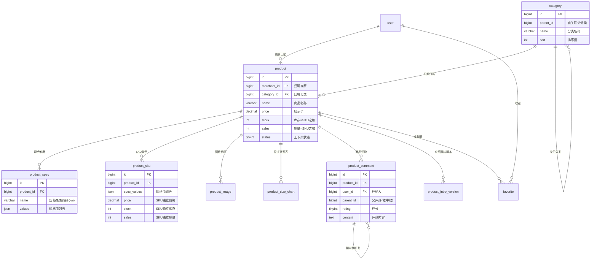
```mermaid
erDiagram
    user ||--o{ product : "商家上架"
    category ||--o{ product : "分类归属"
    category ||--o{ category : "父子分类"
    product ||--o{ product_spec : "规格维度"
    product ||--o{ product_sku : "SKU单元"
    product ||--o{ product_image : "图片相册"
    product ||--o{ product_size_chart : "尺寸对照表"
    product ||--o{ product_comment : "商品评论"
    product_comment ||--o{ product_comment : "楼中楼回复"
    product ||--o{ product_intro_version : "介绍审核版本"
    user ||--o{ favorite : "收藏"
    product ||--o{ favorite : "被收藏"

    product {
        bigint id PK
        bigint merchant_id FK "归属商家"
        bigint category_id FK "归属分类"
        varchar name "商品名称"
        decimal price "展示价"
        int stock "库存=SKU之和"
        int sales "销量=SKU之和"
        tinyint status "上下架状态"
    }
    product_sku {
        bigint id PK
        bigint product_id FK
        json spec_values "规格值组合"
        decimal price "SKU独立价格"
        int stock "SKU独立库存"
        int sales "SKU独立销量"
    }
    product_spec {
        bigint id PK
        bigint product_id FK
        varchar name "规格名(颜色/尺码)"
        json values "规格值列表"
    }
    product_comment {
        bigint id PK
        bigint product_id FK
        bigint user_id FK "评论人"
        bigint parent_id "父评论(楼中楼)"
        tinyint rating "评分"
        text content "评论内容"
    }
    category {
        bigint id PK
        bigint parent_id "自关联父分类"
        varchar name "分类名称"
        int sort "排序值"
    }
```

图2-3 商品业务域E-R图

订单与支付退款业务域以订单为中心，采用"一单多商家拆分发货+明细快照+支付流水+退款四表"的设计，如图2-4所示。

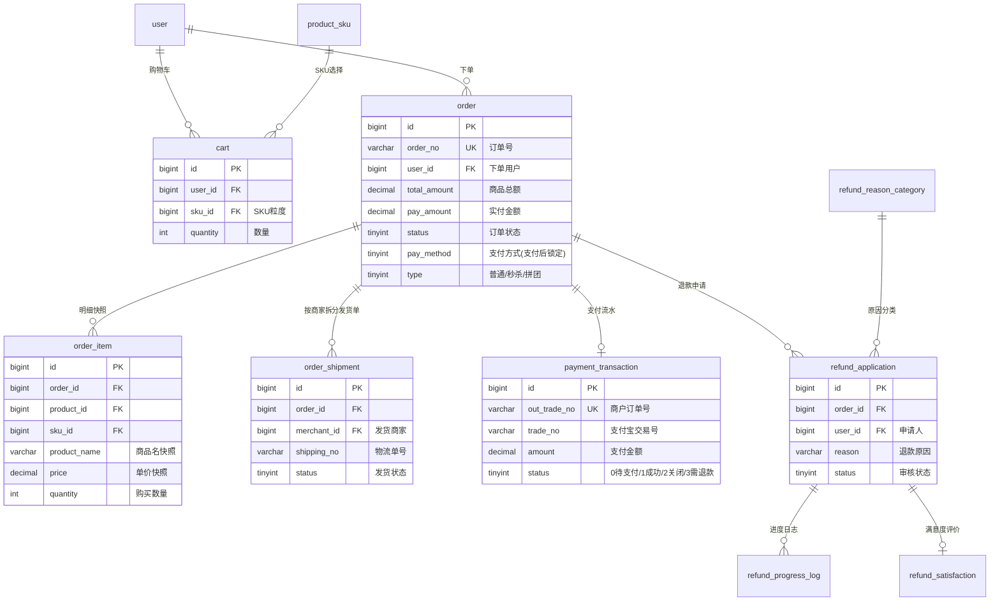
```mermaid
erDiagram
    user ||--o{ cart : "购物车"
    product_sku ||--o{ cart : "SKU选择"
    user ||--o{ order : "下单"
    order ||--o{ order_item : "明细快照"
    order ||--o{ order_shipment : "按商家拆分发货单"
    order ||--o| payment_transaction : "支付流水"
    order ||--o{ refund_application : "退款申请"
    refund_reason_category ||--o{ refund_application : "原因分类"
    refund_application ||--o{ refund_progress_log : "进度日志"
    refund_application ||--o| refund_satisfaction : "满意度评价"

    order {
        bigint id PK
        varchar order_no UK "订单号"
        bigint user_id FK "下单用户"
        decimal total_amount "商品总额"
        decimal pay_amount "实付金额"
        tinyint status "订单状态"
        tinyint pay_method "支付方式(支付后锁定)"
        tinyint type "普通/秒杀/拼团"
    }
    order_item {
        bigint id PK
        bigint order_id FK
        bigint product_id FK
        bigint sku_id FK
        varchar product_name "商品名快照"
        decimal price "单价快照"
        int quantity "购买数量"
    }
    order_shipment {
        bigint id PK
        bigint order_id FK
        bigint merchant_id FK "发货商家"
        varchar shipping_no "物流单号"
        tinyint status "发货状态"
    }
    payment_transaction {
        bigint id PK
        varchar out_trade_no UK "商户订单号"
        varchar trade_no "支付宝交易号"
        decimal amount "支付金额"
        tinyint status "0待支付/1成功/2关闭/3需退款"
    }
    refund_application {
        bigint id PK
        bigint order_id FK
        bigint user_id FK "申请人"
        varchar reason "退款原因"
        tinyint status "审核状态"
    }
    cart {
        bigint id PK
        bigint user_id FK
        bigint sku_id FK "SKU粒度"
        int quantity "数量"
    }
```

图2-4 订单与支付退款业务域E-R图

营销与拼团业务域表数量最多（16张），核心实体为优惠券模板与持有记录、秒杀场次（双模式）、任务制活动以及拼团三表，如图2-5所示。

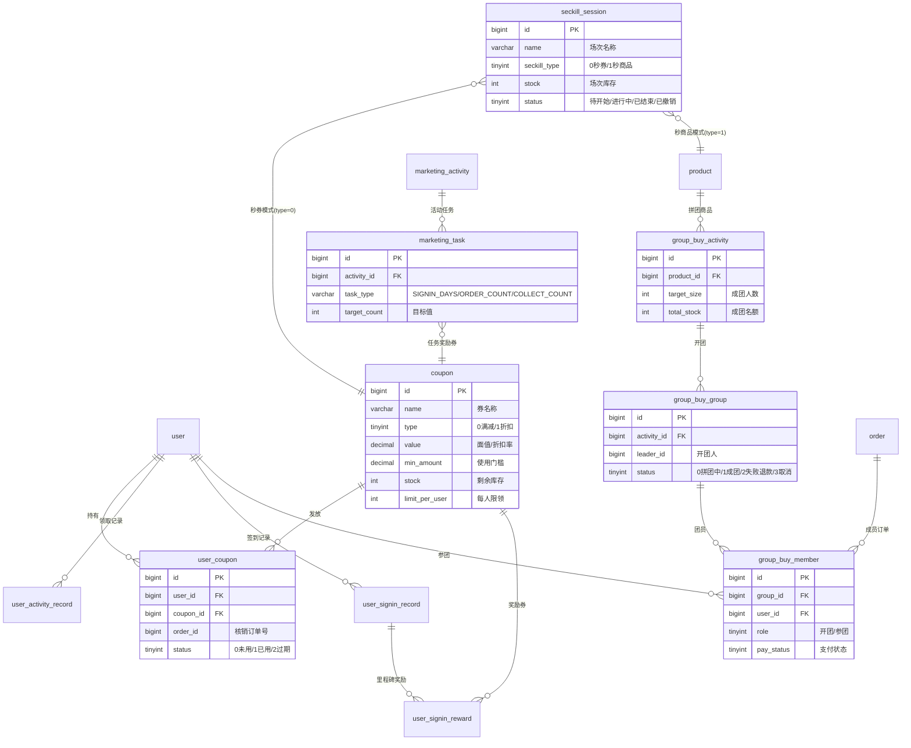
```mermaid
erDiagram
    user ||--o{ user_coupon : "持有"
    coupon ||--o{ user_coupon : "发放"
    seckill_session }o--|| coupon : "秒券模式(type=0)"
    seckill_session }o--|| product : "秒商品模式(type=1)"
    marketing_activity ||--o{ marketing_task : "活动任务"
    marketing_task }o--|| coupon : "任务奖励券"
    user ||--o{ user_activity_record : "领取记录"
    user ||--o{ user_signin_record : "签到记录"
    user_signin_record ||--o{ user_signin_reward : "里程碑奖励"
    coupon ||--o{ user_signin_reward : "奖励券"
    product ||--o{ group_buy_activity : "拼团商品"
    group_buy_activity ||--o{ group_buy_group : "开团"
    group_buy_group ||--o{ group_buy_member : "团员"
    user ||--o{ group_buy_member : "参团"
    order ||--o{ group_buy_member : "成员订单"

    coupon {
        bigint id PK
        varchar name "券名称"
        tinyint type "0满减/1折扣"
        decimal value "面值/折扣率"
        decimal min_amount "使用门槛"
        int stock "剩余库存"
        int limit_per_user "每人限领"
    }
    user_coupon {
        bigint id PK
        bigint user_id FK
        bigint coupon_id FK
        bigint order_id "核销订单号"
        tinyint status "0未用/1已用/2过期"
    }
    seckill_session {
        bigint id PK
        varchar name "场次名称"
        tinyint seckill_type "0秒券/1秒商品"
        int stock "场次库存"
        tinyint status "待开始/进行中/已结束/已撤销"
    }
    marketing_task {
        bigint id PK
        bigint activity_id FK
        varchar task_type "SIGNIN_DAYS/ORDER_COUNT/COLLECT_COUNT"
        int target_count "目标值"
    }
    group_buy_activity {
        bigint id PK
        bigint product_id FK
        int target_size "成团人数"
        int total_stock "成团名额"
    }
    group_buy_group {
        bigint id PK
        bigint activity_id FK
        bigint leader_id "开团人"
        tinyint status "0拼团中/1成团/2失败退款/3取消"
    }
    group_buy_member {
        bigint id PK
        bigint group_id FK
        bigint user_id FK
        tinyint role "开团/参团"
        tinyint pay_status "支付状态"
    }
```

图2-5 营销与拼团业务域E-R图

其中几张关键表的设计说明如下：

（1）order表为订单主表，除订单号、金额、状态外，还保存pay_method支付方式（1微信/2支付宝，支付后锁定）、seckill_session_id秒杀来源标记、type订单类型（普通/秒杀/拼团）；order_shipment按商家维度将一单拆分为多个发货单，适配多商家同单购物场景。

（2）product_sku表保存不同规格组合的价格、库存与销量，product表的库存和销量由SKU汇总维护，二者通过应用层保证一致。

（3）payment_transaction表为支付宝支付流水表，以商户订单号（out_trade_no）为唯一键，记录支付宝交易号、买家账号、支付状态（0待支付/1成功/2已关闭/3需退款）与通知时间，是支付对账自愈的数据基础。

（4）group_buy_group表通过状态机（0拼团中/1已成团/2失败已退款/3已取消）描述拼团全生命周期，团员表记录开团/参团角色与支付状态。

### 2.5 系统功能模块设计

系统整体按"三端七模块"组织功能，功能模块划分如图2-6所示。

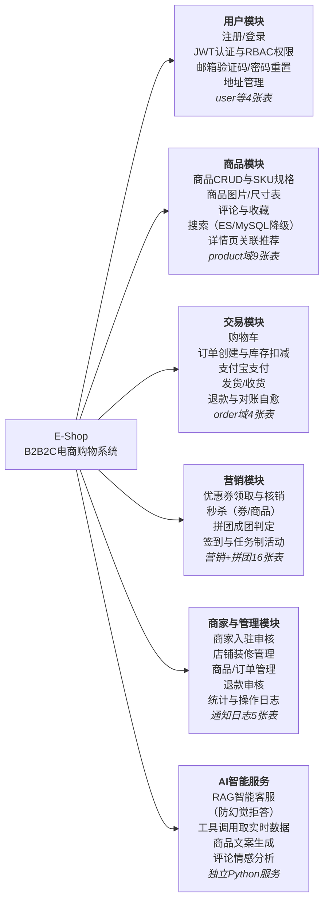
```mermaid
graph LR
    ROOT["E-Shop<br/>B2B2C电商购物系统"]
    ROOT --> M1["<b>用户模块</b><br/>注册/登录<br/>JWT认证与RBAC权限<br/>邮箱验证码/密码重置<br/>地址管理<br/><i>user等4张表</i>"]
    ROOT --> M2["<b>商品模块</b><br/>商品CRUD与SKU规格<br/>商品图片/尺寸表<br/>评论与收藏<br/>搜索（ES/MySQL降级）<br/>详情页关联推荐<br/><i>product域9张表</i>"]
    ROOT --> M3["<b>交易模块</b><br/>购物车<br/>订单创建与库存扣减<br/>支付宝支付<br/>发货/收货<br/>退款与对账自愈<br/><i>order域4张表</i>"]
    ROOT --> M4["<b>营销模块</b><br/>优惠券领取与核销<br/>秒杀（券/商品）<br/>拼团成团判定<br/>签到与任务制活动<br/><i>营销+拼团16张表</i>"]
    ROOT --> M5["<b>商家与管理模块</b><br/>商家入驻审核<br/>店铺装修管理<br/>商品/订单管理<br/>退款审核<br/>统计与操作日志<br/><i>通知日志5张表</i>"]
    ROOT --> M6["<b>AI智能服务</b><br/>RAG智能客服<br/>（防幻觉拒答）<br/>工具调用取实时数据<br/>商品文案生成<br/>评论情感分析<br/><i>独立Python服务</i>"]
```

图2-6 系统功能模块图

各模块的完整功能需求见2.1节表2-1。各模块间通过Service层接口协作，跨模块的一致性关键点（如支付成功后"改订单状态+加销量+发MQ+拼团成团判定"）收敛到统一的入账逻辑，避免多处维护造成状态不一致。

后端代码按Controller—Service—Mapper三层组织，以订单模块为例的分层架构类图如图2-7所示：Controller层只做参数校验与结果封装，业务逻辑与事务边界收敛在Service实现层，Mapper层继承MyBatis-Plus的BaseMapper获得通用CRUD能力；横切关注点（JWT鉴权过滤、AOP操作日志、全局异常处理）通过过滤器、切面与@RestControllerAdvice织入，不侵入业务代码。

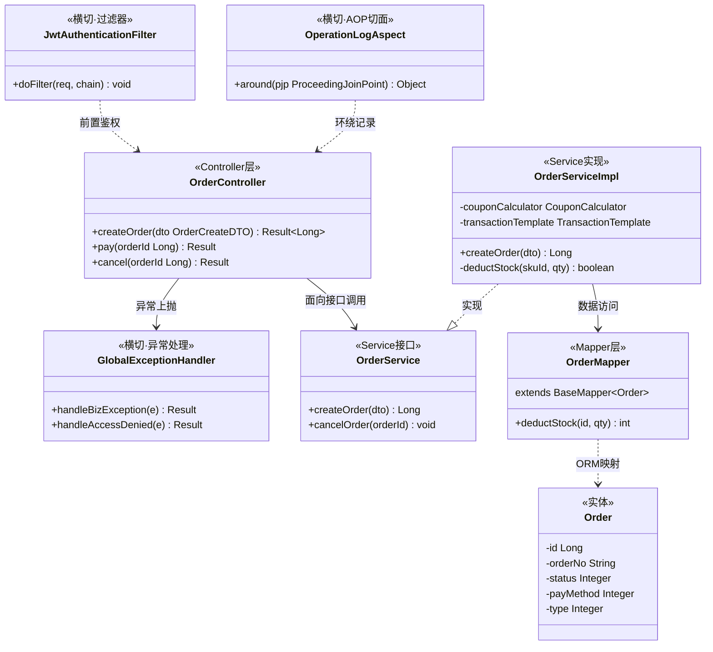
```mermaid
classDiagram
    class JwtAuthenticationFilter {
        <<横切·过滤器>>
        +doFilter(req, chain) void
    }
    class OperationLogAspect {
        <<横切·AOP切面>>
        +around(pjp ProceedingJoinPoint) Object
    }
    class GlobalExceptionHandler {
        <<横切·异常处理>>
        +handleBizException(e) Result
        +handleAccessDenied(e) Result
    }
    class OrderController {
        <<Controller层>>
        +createOrder(dto OrderCreateDTO) Result~Long~
        +pay(orderId Long) Result
        +cancel(orderId Long) Result
    }
    class OrderService {
        <<Service接口>>
        +createOrder(dto) Long
        +cancelOrder(orderId) void
    }
    class OrderServiceImpl {
        <<Service实现>>
        -couponCalculator CouponCalculator
        -transactionTemplate TransactionTemplate
        +createOrder(dto) Long
        -deductStock(skuId, qty) boolean
    }
    class OrderMapper {
        <<Mapper层>>
        extends BaseMapper~Order~
        +deductStock(id, qty) int
    }
    class Order {
        <<实体>>
        -id Long
        -orderNo String
        -status Integer
        -payMethod Integer
        -type Integer
    }

    JwtAuthenticationFilter ..> OrderController : 前置鉴权
    OperationLogAspect ..> OrderController : 环绕记录
    OrderController --> GlobalExceptionHandler : 异常上抛
    OrderController --> OrderService : 面向接口调用
    OrderServiceImpl ..|> OrderService : 实现
    OrderServiceImpl --> OrderMapper : 数据访问
    OrderMapper ..> Order : ORM映射
```

图2-7 后端分层架构类图（以订单模块为例）

---

<div style="page-break-after: always;"></div>

## 3 系统详细设计与实现

### 3.1 用户认证与权限管理模块

用户认证采用JWT（JSON Web Token）无状态方案，认证与鉴权流程如图3-1所示。

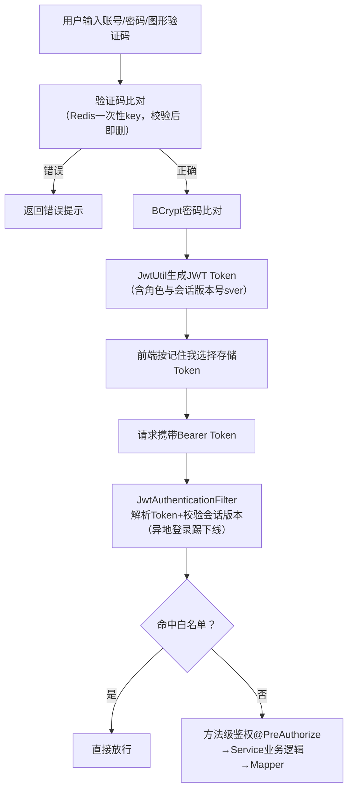
```mermaid
flowchart TD
    A["用户输入账号/密码/图形验证码"] --> B["验证码比对<br/>（Redis一次性key，校验后即删）"]
    B -->|错误| B1["返回错误提示"]
    B -->|正确| C["BCrypt密码比对"]
    C --> D["JwtUtil生成JWT Token<br/>（含角色与会话版本号sver）"]
    D --> E["前端按记住我选择存储Token"]
    E --> F["请求携带Bearer Token"]
    F --> G["JwtAuthenticationFilter<br/>解析Token+校验会话版本<br/>（异地登录踢下线）"]
    G --> H{"命中白名单？"}
    H -->|是| H1["直接放行"]
    H -->|否| I["方法级鉴权@PreAuthorize<br/>→Service业务逻辑→Mapper"]
```

图3-1 用户认证与请求鉴权流程图

后端使用Spring Security构建安全过滤链：`csrf().disable()`、无状态会话策略、`JwtAuthenticationFilter`置于`UsernamePasswordAuthenticationFilter`之前。Token中除常规声明外还携带会话版本号（sver），过滤器解析后与Redis中的在线会话版本比对，实现"异地登录踢下线"。启动类开启`@EnableMethodSecurity`，管理端Controller统一添加`@PreAuthorize("hasRole('ADMIN')")`注解实现方法级权限控制；商家端接口按操作对象做归属校验（如商家只能操作自己名下的商品）。

开发过程中该模块发现并整改了两处高危问题：一是Spring Security 6起方法级安全默认不开启，导致18处`@PreAuthorize`注解全部失效，任意登录用户可调用管理接口（整改后实测普通用户访问管理接口返回403）；二是图形验证码原为条件校验，不传验证码参数即可绕过，已改为必填强校验且验证码一次性有效。

### 3.2 商品管理模块

商品模块支持管理员和商家对商品进行发布、编辑、上下架和删除操作。商品支持多规格SKU：商家维护规格维度（如颜色、尺码）后，系统组合生成SKU明细，每个SKU独立维护价格、库存、销量、图片；商品维度的库存与销量始终等于SKU之和，商家编辑规格导致的SKU删除重插场景下，系统按规格内容规范化键缓存旧销量并在重插后回填，防止销量数据丢失。

**商品搜索与降级。** 商品搜索支持Elasticsearch全文检索和MySQL降级两种方式，降级流程如图3-2所示。

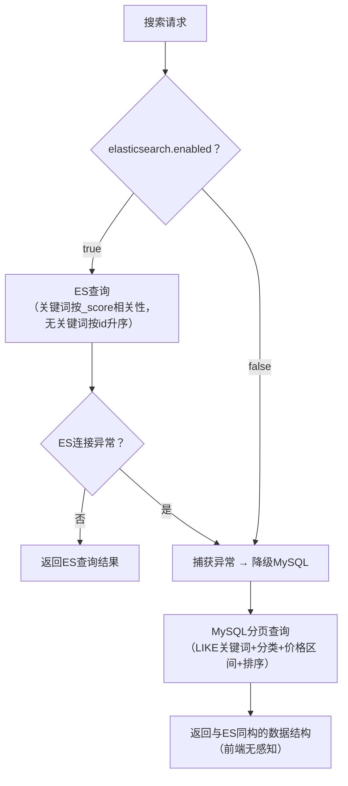
```mermaid
flowchart TD
    A["搜索请求"] --> B{"elasticsearch.enabled？"}
    B -->|true| C["ES查询<br/>（关键词按_score相关性，无关键词按id升序）"]
    C --> D{"ES连接异常？"}
    D -->|否| F["返回ES查询结果"]
    D -->|是| E["捕获异常 → 降级MySQL"]
    B -->|false| E
    E --> G["MySQL分页查询<br/>（LIKE关键词+分类+价格区间+排序）"]
    G --> H["返回与ES同构的数据结构<br/>（前端无感知）"]
```

图3-2 商品搜索降级流程图

后端提供`elasticsearch.enabled`开关：开关关闭时直接走MySQL分页查询（关键词模糊匹配、分类过滤、价格区间过滤、价格/销量/最新排序）；开关打开但ES连接异常时自动捕获异常并降级，返回与ES查询同构的数据结构，前端无感知。该设计保证搜索功能不因外部依赖故障而完全不可用。

**浏览量统计。** 商品浏览量采用Redis原子自增计数（`product:view:{id}`），每5分钟定时任务通过GETDEL原子取值并批量落库，详情接口返回数据库累计值与Redis增量之和，在降低数据库压力的同时保证浏览量实时性。

**详情页关联推荐。** 商品详情页提供关联推荐，采用不依赖用户行为埋点的冷启动方案，基于分类与店铺两个维度生成推荐结果：同类相似商品取同分类下的在售商品，同店热销取同商家按销量排序的商品，两组结果跨组去重避免同页重复，同类不足时不以无关商品充数，前端对空分组自动隐藏。该方案无需浏览、下单等行为数据积累，新上架商品同样可以出现在推荐位中，实现成本低且可解释性强。

**富文本介绍审核。** 商品富文本介绍采用版本化存储（product_intro_version表）：商家提交后进入待审核状态（status=1），每次提交生成新版本号；管理员审核通过后内容同步至商品主表并对用户可见，驳回时必须填写原因；审核期间详情页继续展示最近通过版本。版本化设计支持追溯与驳回后基于最新版本修改重提。

### 3.3 购物车与订单模块

购物车以SKU为粒度存储，同一商品不同规格可同时加入。购物车列表通过"收集去重商品/SKU ID→各一次批量查询→内存组装"的方式将查询次数从1+2N次降为固定3次，消除N+1问题。

订单模块是系统的核心模块，创建流程如图3-3所示。

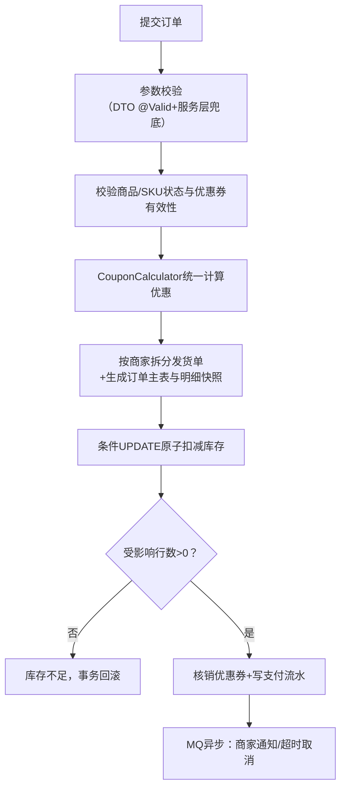
```mermaid
flowchart TD
    A["提交订单"] --> B["参数校验<br/>（DTO @Valid+服务层兜底）"]
    B --> C["校验商品/SKU状态与优惠券有效性"]
    C --> D["CouponCalculator统一计算优惠"]
    D --> E["按商家拆分发货单<br/>+生成订单主表与明细快照"]
    E --> F["条件UPDATE原子扣减库存"]
    F --> G{"受影响行数>0？"}
    G -->|否| G1["库存不足，事务回滚"]
    G -->|是| H["核销优惠券+写支付流水"]
    H --> I["MQ异步：商家通知/超时取消"]
```

图3-3 订单创建流程图

针对并发超卖问题，下单扣库存不采用"先查询再修改"的方式，而是通过Mapper层条件UPDATE实现原子扣减：

```sql
UPDATE product_sku
SET stock = stock - #{qty}
WHERE id = #{id} AND stock >= #{qty}
```

当受影响行数为0时表示库存不足，事务回滚。商品维度库存、秒杀场次库存、优惠券库存同样采用条件UPDATE保证并发安全。优惠券金额计算收敛到`CouponCalculator`统一类：满减券优惠额为面值，折扣券按"实付=总额×(value/10)"计算并受最高优惠上限封顶，前后端结算预览与后端下单共用同一计算逻辑，保证口径一致。

订单状态机为：待付款→待发货→待收货→已完成，另有已取消、退款中、已退款分支。取消订单时回退库存、销量和优惠券状态（按订单号反查重置）；订单超时30分钟未支付由自动取消任务（每5分钟调度，另有RabbitMQ延迟消息方案）回滚全部占用资源。

订单支付后若需售后，用户可发起退款申请，流程采用"商家初审+平台终审"两级审核模式，如图3-4所示：用户选择原因分类并提交申请后订单进入退款中状态，商家初审通过转平台终审，终审通过后执行原路退款并回退库存与销量，每一步流转均写入退款进度日志，用户可在完成后进行满意度评价。

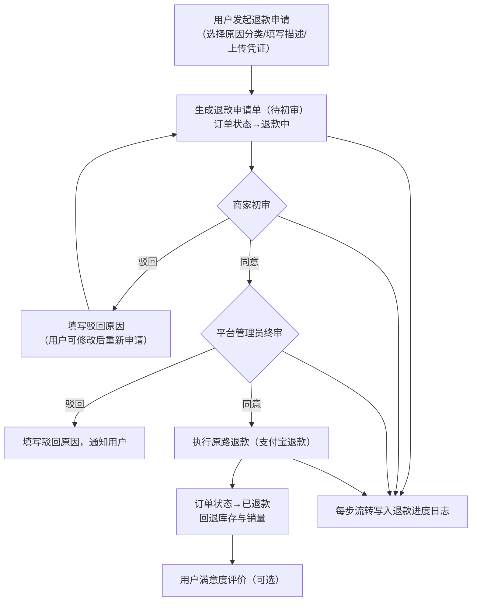
```mermaid
flowchart TD
    A["用户发起退款申请<br/>（选择原因分类/填写描述/上传凭证）"] --> B["生成退款申请单（待初审）<br/>订单状态→退款中"]
    B --> C{"商家初审"}
    C -->|驳回| C1["填写驳回原因<br/>（用户可修改后重新申请）"]
    C -->|同意| D{"平台管理员终审"}
    C1 --> B
    D -->|驳回| D1["填写驳回原因，通知用户"]
    D -->|同意| E["执行原路退款（支付宝退款）"]
    E --> F["订单状态→已退款<br/>回退库存与销量"]
    F --> G["用户满意度评价（可选）"]
    B --> H["每步流转写入退款进度日志"]
    C --> H
    D --> H
    E --> H
```

图3-4 退款申请与审核流程图

### 3.4 支付模块

系统接入支付宝沙箱开放平台实现真实在线支付，形成"下单→支付→回跳→入账"的完整闭环。由于部署环境未配置内网穿透，支付宝的异步回调通知（notify_url）无法触达后端，系统据此设计了**查单对账自愈机制**，支付与对账时序如图3-5所示。

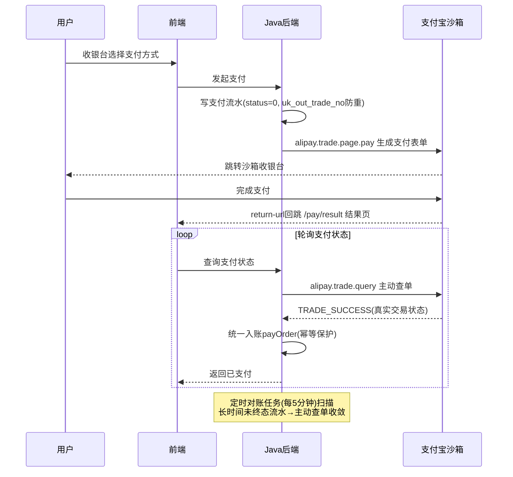
```mermaid
sequenceDiagram
    participant U as 用户
    participant F as 前端
    participant B as Java后端
    participant A as 支付宝沙箱

    U->>F: 收银台选择支付方式
    F->>B: 发起支付
    B->>B: 写支付流水(status=0, uk_out_trade_no防重)
    B->>A: alipay.trade.page.pay 生成支付表单
    A-->>U: 跳转沙箱收银台
    U->>A: 完成支付
    A-->>F: return-url回跳 /pay/result 结果页
    loop 轮询支付状态
        F->>B: 查询支付状态
        B->>A: alipay.trade.query 主动查单
        A-->>B: TRADE_SUCCESS(真实交易状态)
        B->>B: 统一入账payOrder(幂等保护)
        B-->>F: 返回已支付
    end
    Note over B: 定时对账任务(每5分钟)扫描<br/>长时间未终态流水→主动查单收敛
```

图3-5 支付与对账自愈时序图

统一入账逻辑`payOrder`完成：更新订单支付状态与支付时间、更新支付流水（status=1并记录支付宝交易号）、累加商品与SKU销量、发送库存扣减与商家通知MQ消息、触发拼团成团判定、清理商品缓存。入账以订单支付状态做幂等保护，确保回调与轮询两条路径即使并发触发也不会重复入账。此外，定时对账任务每5分钟扫描长时间未到达终态的支付流水并主动查单，将订单状态收敛到与支付宝一致。对于"用户支付时订单已被取消"的异常场景，流水置为"需退款"状态（status=3）转人工或自动处理。

支付方式在订单生命周期内保持一致：下单时选择的支付方式落库到订单表（pay_method），收银台默认预选该方式，用户改选后同步回写订单，支付完成后支付方式锁定不可变更，避免出现订单与实际支付渠道不一致的对账问题。

### 3.5 秒杀模块

秒杀模块支持两种模式，通过场次表的`seckill_type`字段区分：**秒券模式**（type=0）绑定优惠券，抢购成功写入用户持券表，不生成订单；**商品秒杀模式**（type=1）绑定商品或SKU并设置秒杀价，抢购成功直接生成待支付订单（订单表记录seckill_session_id来源标记），秒杀库存与商品实际库存双重扣减。场次状态机（待开始→进行中→已结束/已撤销）由每分钟执行的定时任务自动推进，开始时预热Redis库存，关联券/商品失效时自动撤销。

秒杀是典型的读多写少、瞬时洪峰、极低成功率场景。系统采用**分层拦截漏斗**设计，越靠前的拦截成本越低，如图3-6所示。

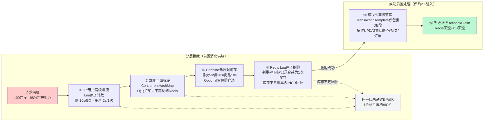
```mermaid
flowchart LR
    subgraph L["分层拦截（前置消化洪峰）"]
        direction TB
        A["请求洪峰<br/>100并发 · 98%将被拒绝"] --> B["① IP/用户两级限流<br/>Lua原子计数<br/>IP 10s/5次 · 用户 2s/1次"]
        B --> C["② 本地售罄标记<br/>ConcurrentHashMap<br/>O(1)拒绝，不再访问Redis"]
        C --> D["③ Caffeine元数据缓存<br/>场次5s/券30s/商品10s<br/>Optional空值防穿透"]
        D --> E["④ Redis Lua原子抢购<br/>判重+扣减+记录合并为1次RTT<br/>库存不足脚本内INCR回补"]
        B -.-> X["任一层未通过即拒绝<br/>（合计拦截约98%）"]
        C -.-> X
        E -.->|库存不足回补| X
    end
    subgraph R["成功后置处理（仅约2%进入）"]
        direction TB
        F["⑤ 编程式事务落库<br/>TransactionTemplate仅包裹DB段<br/>条件UPDATE扣减+写持券/订单"]
        G["⑥ 失败补偿 rollbackClaim<br/>Redis回滚+DB回滚"]
        F --> G
    end
    E -->|抢购成功| F
    style A fill:#fecaca
    style X fill:#f3f4f6
    style G fill:#bbf7d0
```

图3-6 秒杀分层拦截漏斗示意图

秒杀模块的核心类结构如图3-7所示：Controller层仅做参数接收与结果封装；SeckillServiceImpl是漏斗设计的载体，内部持有本地售罄标记表、Caffeine缓存、Redis模板（执行Lua原子脚本）与编程式事务模板；落库段依赖各Mapper的条件UPDATE完成库存扣减，任一环节失败由补偿方法统一回滚。

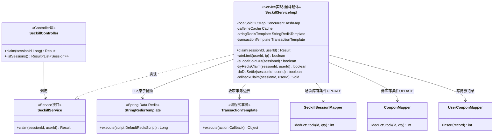
```mermaid
classDiagram
    class SeckillController {
        <<Controller层>>
        +claim(sessionId Long) Result
        +listSessions() Result~List~Session~~
    }
    class SeckillService {
        <<Service接口>>
        +claim(sessionId, userId) Result
    }
    class SeckillServiceImpl {
        <<Service实现·漏斗载体>>
        -localSoldOutMap ConcurrentHashMap
        -caffeineCache Cache
        -stringRedisTemplate StringRedisTemplate
        -transactionTemplate TransactionTemplate
        +claim(sessionId, userId) Result
        -rateLimit(userId, ip) boolean
        -isLocalSoldOut(sessionId) boolean
        -tryRedisClaim(sessionId, userId) boolean
        -doDbSettle(sessionId, userId) boolean
        -rollbackClaim(sessionId, userId) void
    }
    class StringRedisTemplate {
        <<Spring Data Redis>>
        +execute(script DefaultRedisScript) Long
    }
    class TransactionTemplate {
        <<编程式事务>>
        +execute(action Callback) Object
    }
    class SeckillSessionMapper {
        +deductStock(id, qty) int
    }
    class CouponMapper {
        +deductStock(id, qty) int
    }
    class UserCouponMapper {
        +insert(record) int
    }

    SeckillController --> SeckillService : 调用
    SeckillServiceImpl ..|> SeckillService : 实现
    SeckillServiceImpl --> StringRedisTemplate : Lua原子抢购
    SeckillServiceImpl --> TransactionTemplate : 收窄事务边界
    SeckillServiceImpl --> SeckillSessionMapper : 场次库存条件UPDATE
    SeckillServiceImpl --> CouponMapper : 券库存条件UPDATE
    SeckillServiceImpl --> UserCouponMapper : 写持券记录
```

图3-7 秒杀模块核心类图

该设计有两个关键决策：

（1）**事务边界收窄。** 原实现将整个抢购方法标注`@Transactional`，导致98%被拒绝的请求（重复/售罄）也要先从HikariCP连接池（默认10连接）借出连接、开启空事务再回滚；洪峰下连接池被无效流量占满，所有请求排队等连接。优化后主流程去除注解事务，仅"扣库存+写记录"的落库段用编程式事务包裹，拒绝流量在触达数据库前即被拦截，一致性语义与原实现完全等价（失败时事务回滚+Redis抢占回滚）。

（2）**Lua原子化消除竞态窗口。** 判重、扣减、记录三步若分三次Redis往返执行，之间存在被并发请求穿插的竞态窗口；合并为一段Lua脚本后单次执行天然原子，且库存不足时在脚本内INCR回补，不产生脏状态。限流器同样存在"INCR后进程崩溃导致EXPIRE未执行、计数键永不过期"的竞态，一并改为Lua原子化（INCR返回1时才设置过期）。

秒杀订单超时未支付时，自动取消任务回滚商品库存、秒杀场次库存与Redis防重记录（SREM移除用户），保证库存可被再次抢购。经JMeter压测验证，上述优化使秒杀链路吞吐量提升68%、P99尾延迟下降93%且零超卖，详见4.4节。

### 3.6 优惠券与营销活动模块

**优惠券。** 优惠券分满减券（type=0）与折扣券（type=1），模板字段包含面值/折扣率、使用门槛、折扣上限、库存、每人限领、获取方式（普通领取/签到/新人礼包/秒杀/活动奖励）与有效期。领券通过条件UPDATE原子扣减库存（`UPDATE coupon SET stock = stock - 1 WHERE id = #{id} AND stock > 0`），受影响行数为0即提示已抢完；下单抵扣时校验归属、状态、门槛与有效期，订单成功后核销，取消订单时按订单号反查归还。过期判断在查询时惰性处理（已使用/已过期的券不占限领名额），无需定时任务扫描。

**通用任务制营销活动。** 营销活动采用"活动+任务"两级结构：管理员创建活动（起止时间、图标、说明）并配置多个任务，任务类型包括累计签到天数（SIGNIN_DAYS）、已支付订单数（ORDER_COUNT）、收藏商品数（COLLECT_COUNT），完成目标后可领取指定优惠券奖励。任务进度**不落库**，而是根据活动起止时间实时统计（签到记录、已支付订单、收藏表分别按时间范围计数），仅在领取奖励时通过user_activity_record表（user_id+activity_id+task_id+source组合查询）防重，避免定时任务对账成本。列表接口通过批量查询任务、批量查询奖励券、批量查询已领记录后内存组装，规避N+1查询。

**签到。** 签到记录表以（user_id, sign_date）唯一键防止同日重复签到；连续签到天数从当日向前逐日回溯统计；达到3/7/14/30天里程碑时自动发放对应奖励券。签到与节日优惠券活动联动，达到活动要求的连续签到天数后可领取节日券。

**拼团。** 拼团模块采用三表结构（活动/团/团员），团的状态机如图3-8所示。

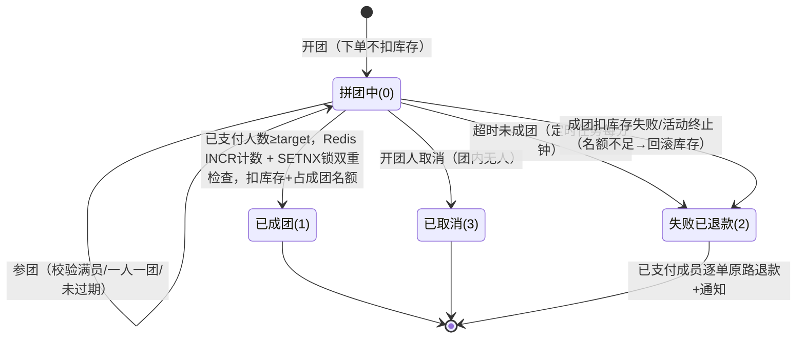
```mermaid
stateDiagram-v2
    state "拼团中(0)" as S0
    state "已成团(1)" as S1
    state "失败已退款(2)" as S2
    state "已取消(3)" as S3

    [*] --> S0 : 开团（下单不扣库存）
    S0 --> S0 : 参团（校验满员/一人一团/未过期）
    S0 --> S1 : 已支付人数≥target，Redis INCR计数 + SETNX锁双重检查，扣库存+占成团名额
    S0 --> S3 : 开团人取消（团内无人）
    S0 --> S2 : 超时未成团（定时任务每分钟）
    S0 --> S2 : 成团扣库存失败/活动终止（名额不足→回滚库存）
    S1 --> [*]
    S3 --> [*]
    S2 --> [*] : 已支付成员逐单原路退款+通知
```

图3-8 拼团状态机图

拼团的核心设计是**"成团才扣库存"**策略：开团和参团均不占用库存（仅生成待支付订单并占团位），满员成团时才以条件UPDATE原子扣减商品/SKU库存并占用活动成团名额（total_stock），名额不足时回滚已扣库存并整团失败退款。该策略避免未成团订单长期占压库存导致其他用户无法购买。成团判定由支付成功回调触发：Redis INCR计数（`groupbuy:count:{groupId}`）统计已支付人数，满员后以SETNX锁（TTL 10秒）+数据库状态双重检查防止并发双触发；计数与锁的key在成团/取消后清理。超时未成团的团由每分钟执行的定时任务扫描，先对已支付成员逐单原路退款并通知，再以条件更新（WHERE status=0）置为失败状态，防止与活动取消并发重复处理。拼团订单取消时因库存从未扣减，仅需释放团位；开团人取消且团内无人时团直接置为已取消。

### 3.7 AI智能服务模块

AI智能服务由独立部署的Python FastAPI服务（端口5000）承担，与Java业务系统解耦：前端通过`/ai`路径代理访问，服务内部仅调用后端无需登录的公开GET接口（商品搜索、详情、热门、秒杀场次），不传递JWT。前端提供全局悬浮球入口和独立客服页，会话历史保存于sessionStorage，前端限流60秒内最多6条，服务端另有每IP每分钟10条的兜底限流。服务基于通义千问大模型实现三类AI能力，其中RAG客服的问答流程如图3-9所示。

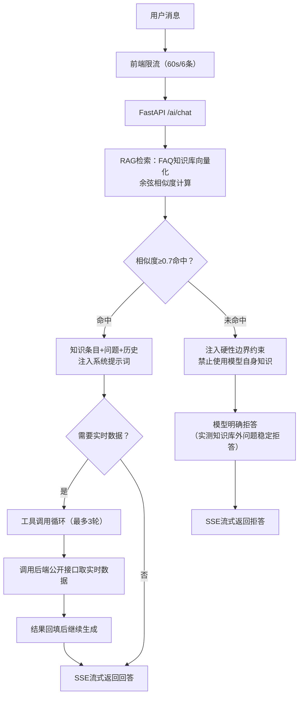
```mermaid
flowchart TD
    A["用户消息"] --> B["前端限流（60s/6条）"]
    B --> C["FastAPI /ai/chat"]
    C --> D["RAG检索：FAQ知识库向量化<br/>余弦相似度计算"]
    D --> E{"相似度≥0.7命中？"}
    E -->|命中| F["知识条目+问题+历史<br/>注入系统提示词"]
    E -->|未命中| G["注入硬性边界约束<br/>禁止使用模型自身知识"]
    G --> G1["模型明确拒答<br/>（实测知识库外问题稳定拒答）"]
    F --> H{"需要实时数据？"}
    H -->|是| I["工具调用循环（最多3轮）"]
    I --> J["调用后端公开接口取实时数据"]
    J --> K["结果回填后继续生成"]
    K --> L["SSE流式返回回答"]
    H -->|否| L
    G1 --> M["SSE流式返回拒答"]
```

图3-9 RAG检索增强问答流程图

（1）**RAG检索增强客服。** 知识库以问答对为最小切分单元，问题文本经通义text-embedding-v3向量模型编码后缓存在内存索引中；检索时计算用户问题与各知识条目的余弦相似度，经0.7阈值过滤后取Top 3注入系统提示词。对话模型（qwen-turbo）与向量模型是两个不同模型，前者负责生成、后者负责语义编码，不可混用。防幻觉的关键设计是：当检索结果为空（相似度全部低于阈值）时，提示词注入硬性边界约束，禁止模型使用自身背景知识作答，要求明确告知用户仅解答本平台相关问题——从流程上抑制幻觉而非依赖模型自觉。

（2）**工具调用（Function Calling）。** 模型在需要实时数据时返回结构化工具调用，服务端执行预注册的工具函数（商品搜索、商品详情、热门商品、秒杀场次）请求后端公开接口，将工具结果以tool角色消息回填后交给模型继续生成，最多循环3轮。该机制使AI客服能够获取商品实时价格、库存、秒杀场次等动态信息，回答具备业务时效性。以"查询100元以下的商品"为例，工具调用的完整交互时序如图3-10所示。

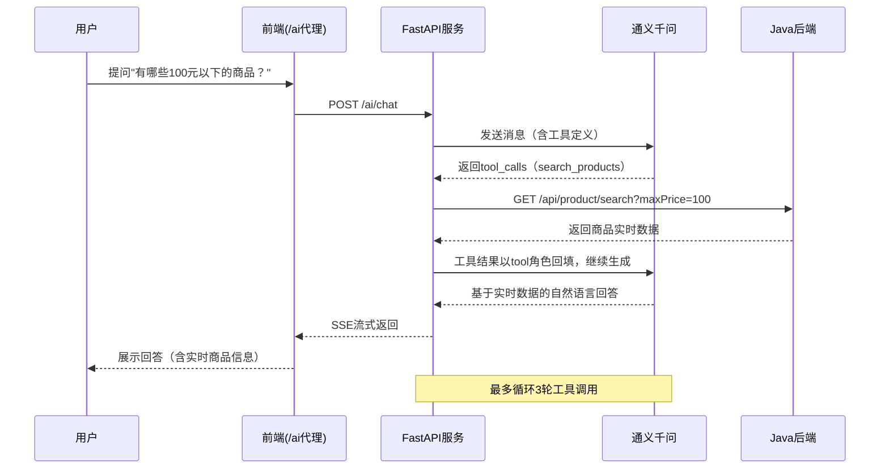
```mermaid
sequenceDiagram
    participant U as 用户
    participant F as 前端(/ai代理)
    participant A as FastAPI服务
    participant L as 通义千问
    participant B as Java后端

    U->>F: 提问"有哪些100元以下的商品？"
    F->>A: POST /ai/chat
    A->>L: 发送消息（含工具定义）
    L-->>A: 返回tool_calls（search_products）
    A->>B: GET /api/product/search?maxPrice=100
    B-->>A: 返回商品实时数据
    A->>L: 工具结果以tool角色回填，继续生成
    L-->>A: 基于实时数据的自然语言回答
    A-->>F: SSE流式返回
    F-->>U: 展示回答（含实时商品信息）
    Note over A,L: 最多循环3轮工具调用
```

图3-10 AI工具调用时序图

（3）**商品文案生成与评论情感分析。** 商家发布商品时可调用文案生成接口（`/ai/generate-product-desc`），输入商品名称、类目、价格等，由大模型输出包含一句话卖点（40字内）、详情描述（5-8句）、SEO关键词（5-8个）的结构化JSON结果供商家编辑采用；针对模型返回可能带json代码围栏的情况做了容错解析。管理员在评论管理页可对当前页评论批量执行情感分析（`/ai/analyze-comments`），每批10条分批处理，单批失败标记中性不影响其他批次，输出正面/负面/中性标签与最多3个内容关键词，辅助运营快速掌握用户反馈。

AI服务内部的模块划分如图3-11所示：路由层承接HTTP与SSE流式响应；核心ChatService编排"RAG检索→工具调用循环→生成"的主流程；KnowledgeBase负责知识加载与向量编码，RAGRetriever基于余弦相似度完成检索过滤；ToolRegistry统一注册与执行工具函数；文案生成与情感分析作为独立能力分别复用LLMClient。

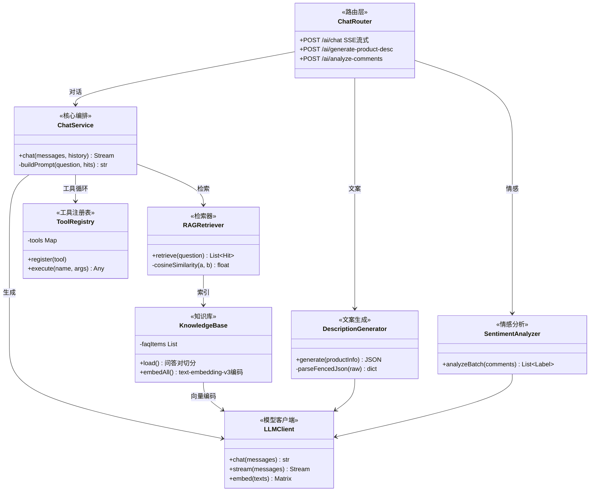
```mermaid
classDiagram
    class ChatRouter {
        <<路由层>>
        +POST /ai/chat SSE流式
        +POST /ai/generate-product-desc
        +POST /ai/analyze-comments
    }
    class ChatService {
        <<核心编排>>
        +chat(messages, history) Stream
        -buildPrompt(question, hits) str
    }
    class RAGRetriever {
        <<检索器>>
        +retrieve(question) List~Hit~
        -cosineSimilarity(a, b) float
    }
    class KnowledgeBase {
        <<知识库>>
        -faqItems List
        +load() 问答对切分
        +embedAll() text-embedding-v3编码
    }
    class ToolRegistry {
        <<工具注册表>>
        -tools Map
        +register(tool)
        +execute(name, args) Any
    }
    class LLMClient {
        <<模型客户端>>
        +chat(messages) str
        +stream(messages) Stream
        +embed(texts) Matrix
    }
    class DescriptionGenerator {
        <<文案生成>>
        +generate(productInfo) JSON
        -parseFencedJson(raw) dict
    }
    class SentimentAnalyzer {
        <<情感分析>>
        +analyzeBatch(comments) List~Label~
    }

    ChatRouter --> ChatService : 对话
    ChatRouter --> DescriptionGenerator : 文案
    ChatRouter --> SentimentAnalyzer : 情感
    ChatService --> RAGRetriever : 检索
    ChatService --> ToolRegistry : 工具循环
    ChatService --> LLMClient : 生成
    RAGRetriever --> KnowledgeBase : 索引
    KnowledgeBase --> LLMClient : 向量编码
    DescriptionGenerator --> LLMClient
    SentimentAnalyzer --> LLMClient
```

图3-11 AI智能服务类图

### 3.8 前端实现

前端项目基于vue3-element-admin模板二次开发，使用Vue3组合式API和TypeScript。项目按用户商城（shop，18个业务模块）、商家中心（merchant）、管理后台（eshop/system）三个端组织views目录，api目录按业务域组织（eshop域22个、system域11个、ai域独立实例），公共能力沉淀在components（25个）、composables和utils中。

**请求封装。** request.ts统一处理Token注入、全屏Loading（引用计数管理并发请求）、响应解包（code=200直接返回data）、401跳转和错误提示。针对开发中发现的两个全局性缺陷做了修复：错误拦截器与文件下载分支未关闭Loading导致任一次网络超时后全屏加载永久卡死（补充hideLoading调用）；Axios类型接口缺少调用签名导致全项目request({...})报TS2349类型错误（补充RequestApi调用签名）。

**权限路由。** 路由守卫采用返回值风格（不使用已废弃的next回调）：未登录访问非公开页面弹出确认框引导登录；已登录按角色根路径重定向（ADMIN→仪表盘，MERCHANT→商家中心，USER→商城首页）；路由级（meta.roles）、按钮级（v-hasPerm指令）、接口级（后端注解）三层权限控制。用户信息采用单次加载模式（模块级Promise缓存），避免每次导航重复请求。

**页面缓存。** 针对首页、秒杀、活动中心等高频访问页面使用keep-alive组件缓存：缓存命中条件为路由meta.keepAlive且组件name与路由name一致；缓存页在onActivated钩子刷新数据、onDeactivated钩子暂停轮询定时器；滚动位置在离开时存入sessionStorage，返回时恢复。该方案兼顾访问速度与数据新鲜度。

**响应式与体验。** 以768px为断点区分桌面/移动布局，商城端在移动端切换为底部Tab导航（首页/秒杀/购物车/活动/我的）并预留安全区高度；支持Element Plus暗色模式；管理后台列表页通过PageSearch、PageContent、PageModal和usePage组合式函数快速搭建CURD页面。

---

<div style="page-break-after: always;"></div>

## 4 系统测试与问题整改

### 4.1 测试环境

系统测试环境如表4-1所示。

表4-1 系统测试环境表

| 类别 | 环境配置 |
| --- | --- |
| 操作系统 | Windows 10/11 |
| 后端 | JDK 17、Spring Boot 3.2.2、Maven |
| 数据库 | MySQL 8.0（库eshops，40张表） |
| 缓存/消息 | Redis 7、RabbitMQ |
| AI服务 | Python 3.12、FastAPI、通义千问（qwen-turbo / text-embedding-v3） |
| 前端 | Node.js 22、pnpm、Vite |
| 测试工具 | JUnit 5、MockMvc、Postman、JMeter 5.6.3（非GUI模式）、浏览器 |

### 4.2 功能测试

系统针对核心业务功能进行了接口实测和页面联调，主要功能测试用例如表4-2所示。

表4-2 核心功能测试用例表

| 编号 | 测试内容 | 预期结果 | 结果 |
| --- | --- | --- | --- |
| F01 | 用户注册、登录 | 注册成功后可登录并获取JWT | 通过 |
| F02 | 图形验证码校验 | 不传或错误验证码被拒绝，验证码一次性有效 | 通过 |
| F03 | 商品搜索与筛选 | ES可用时全文搜索，ES不可用时MySQL降级 | 通过 |
| F04 | 购物车加入与列表 | 不同SKU可同时加入，库存显示正确 | 通过 |
| F05 | 下单支付流程 | 订单生成、库存扣减、支付后状态流转正确 | 通过 |
| F06 | 退款流程 | 商户初审、管理员终审、退款后库存回退 | 通过 |
| F07 | 优惠券领取与使用 | 领券后下单可抵扣，归属校验正确 | 通过 |
| F08 | 秒杀商品抢购 | 生成待支付秒杀订单，防重复抢购 | 通过 |
| F09 | 营销活动领取奖励 | 完成任务后可领取优惠券，重复领取被拒绝 | 通过 |
| F10 | AI客服对话 | 能回答常见问题并返回实时商品信息 | 通过 |
| F11 | 支付宝沙箱支付 | 跳转沙箱支付，回跳结果页，订单状态正确流转 | 通过 |
| F12 | 支付对账自愈 | 回调未触达时，结果页轮询查单确认支付并入账，幂等不重复 | 通过 |
| F13 | 支付方式一致性 | 下单支付方式落库，收银台预选，支付后锁定不可改 | 通过 |
| F14 | 拼团流程 | 开团、参团、满员成团扣库存，超时未成团自动退款 | 通过 |
| F15 | 详情页关联推荐 | 返回同类相似与同店热销两组商品，跨组去重、无自身 | 通过 |
| F16 | AI客服知识库外拒答 | 检索不到依据时明确拒答，不编造答案 | 通过 |
| F17 | 商品文案生成与评论情感分析 | 输出结构化文案/情感标签，批量分析单批失败不影响其他 | 通过 |

### 4.3 安全测试

系统对安全类问题进行了专项测试，主要测试结果如表4-3所示。

表4-3 安全测试用例表

| 编号 | 测试内容 | 预期结果 | 结果 |
| --- | --- | --- | --- |
| S01 | 普通用户访问管理接口 | 返回HTTP 403（整改前为500，权限注解失效） | 通过 |
| S02 | 未登录上传文件 | 返回HTTP 401（整改前匿名放行） | 通过 |
| S03 | 上传非白名单文件 | 返回HTTP 400 | 通过 |
| S04 | 使用他人优惠券下单 | 提示"优惠券不属于当前用户"（整改前可盗用） | 通过 |
| S05 | 重置密码验证码二次使用 | 验证码已过期，不能重复使用 | 通过 |
| S06 | 登录验证码绕过 | 不携带验证码返回"验证码不能为空"（整改前可绕过） | 通过 |
| S07 | 搜索已注销用户 | 已注销用户不出现在结果中 | 通过 |
| S08 | 访问不存在接口 | 返回HTTP 404（整改前兜底为500） | 通过 |

### 4.4 并发与一致性测试

针对库存超卖、优惠券超发等并发问题，系统使用JUnit和MockMvc编写集成测试进行验证，测试结果如表4-4所示。

表4-4 并发与一致性测试用例表

| 编号 | 测试内容 | 预期结果 | 结果 |
| --- | --- | --- | --- |
| C01 | 20个并发请求抢购库存为10的商品 | 成功数不超过10，剩余库存等于10-成功数 | 通过 |
| C02 | 20个并发请求领取库存为5的优惠券 | 成功数不超过5，发放记录数一致 | 通过 |
| C03 | 用户A使用用户B的优惠券下单 | 拒绝下单，事务回滚且库存未扣减 | 通过 |
| C04 | 秒杀商品并发抢购 | 不超卖，Redis库存与数据库库存一致 | 通过 |
| C05 | 秒杀订单超时取消 | 商品库存、秒杀库存与Redis防重记录正确回滚 | 通过 |

在集成测试之外，使用JMeter 5.6.3（非GUI模式）对秒杀核心链路（优惠券秒杀接口）进行了压力测试。压测采用固定变量法保证公平性：基线与优化后使用同一台机器、相同JVM启动参数（限流关闭）、相同数据集（100个真实用户，场次库存100000），100并发线程×50次循环共5000请求（其中仅100个成功、4900个为重复请求拒绝，模拟秒杀"极低成功率"特征），优化后测试前执行3轮预热排除JIT冷启动干扰。压测结果对比如表4-5、图4-1和图4-2所示。

表4-5 秒杀链路压测结果对比表

| 指标 | 优化前（基线） | 优化后 | 变化 |
| --- | --- | --- | --- |
| 吞吐量 QPS | 217.9 | 365.9 | **+68%** |
| 平均响应时间 Avg | 359 ms | 90 ms | -75% |
| P50 中位数 | 301 ms | 89 ms | -70% |
| P90 | 479 ms | 133 ms | -72% |
| P95 | 601 ms | 147 ms | -76% |
| P99 尾延迟 | 2425 ms | 174 ms | **-93%** |
| 最大响应时间 | 3092 ms | 232 ms | -93% |
| 超卖/少卖 | 无 | 无 | — |

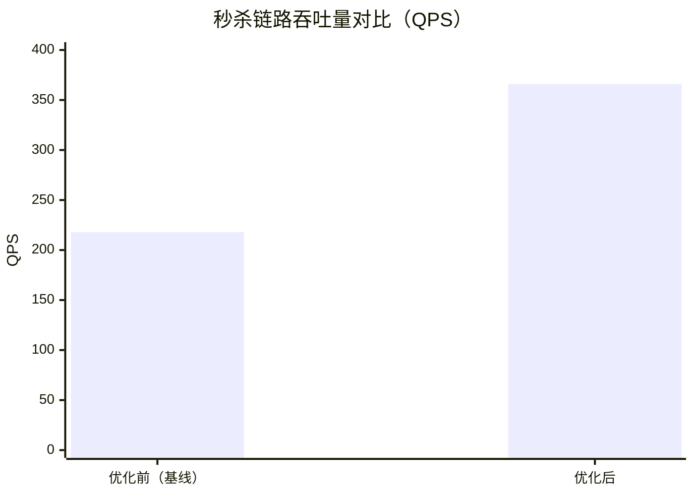
```mermaid
xychart-beta
    title "秒杀链路吞吐量对比（QPS）"
    x-axis ["优化前（基线）", "优化后"]
    y-axis "QPS" 0 --> 400
    bar [217.9, 365.9]
```

图4-1 秒杀链路吞吐量压测对比图

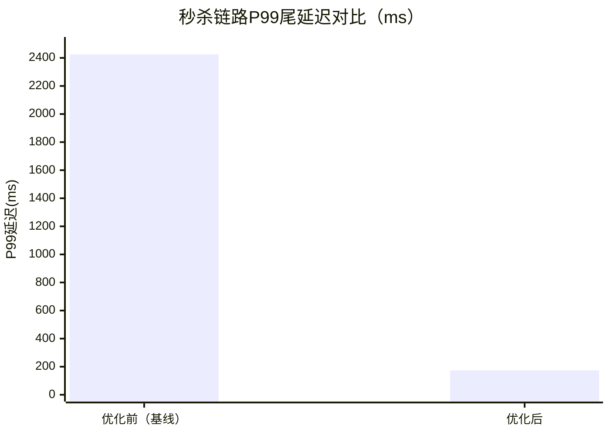
```mermaid
xychart-beta
    title "秒杀链路P99尾延迟对比（ms）"
    x-axis ["优化前（基线）", "优化后"]
    y-axis "P99延迟(ms)" 0 --> 2500
    bar [2425, 174]
```

图4-2 秒杀链路P99延迟压测对比图

压测后三方对账：场次库存剩余99900（=100000-100，与成功领取数严格一致）、券领取总数100、去重用户数100，实现**零超卖、零少卖**。

压测过程中还定位到一个隐蔽的性能瓶颈：吞吐卡在约200 QPS时抓取jstack线程转储，发现104个Tomcat工作线程中35个阻塞在`ServiceLoader→JarURLConnection→JarFileFactory`。根因是jjwt库每次调用`Jwts.parserBuilder().build()`都会扫描全classpath的META-INF/services目录（逐个打开100余个JAR文件，内部存在同步锁），而原代码每个请求构建4~5次解析器。将其改为`@PostConstruct`构建一次全局复用（解析器不可变且线程安全）后，单请求处理成本从46ms降至23ms，是本次优化收益最大的单项，也是"用线程转储证据定位问题而非猜测"的典型实践。

上述优化完成后，秒杀链路与公共请求链路的耗时已趋于持平，剩余瓶颈转移到全局访问日志过滤器上：系统为记录访问日志实现了全局过滤器`TraceFilter`，它在每个业务请求的`finally`块中调用`rabbitTemplate.convertAndSend`发送访问日志消息。虽然代码注释将其标注为"异步发送"，但该方法本身是同步API——消息写入本地发送缓冲区并在当前线程内完成网络发送后才返回。这带来两个问题：一是秒杀洪峰下大量请求线程同时占用消息连接发送日志，请求线程被日志发送占用；二是访问日志与订单通知、超时取消等业务消息共用同一消息通道，日志消息积压时会挤占业务消息的投递，可能波及订单、支付等非秒杀模块。针对该问题，对过滤器实施了异步化改造，其设计如图4-3所示。

```mermaid
flowchart LR
    A["请求处理完成<br/>（finally块）"] --> B["构造访问日志消息<br/>并读取当前traceId"]
    B --> C["提交到专用线程池<br/>（有界队列2000）"]
    C --> D["请求线程立即返回<br/>不再等待MQ发送"]
    C -.->|队列已满| E["丢弃日志并计数<br/>（不阻塞业务请求）"]
    C --> F["async-log-sender工作线程<br/>（固定2个）"]
    F --> G["convertAndSend<br/>携带traceId发往RabbitMQ"]
    G --> H["VisitLogConsumer<br/>手动ack写入visit_log"]
    style A fill:#e0f2fe
    style E fill:#f3f4f6
    style D fill:#bbf7d0
```

图4-3 访问日志异步发送改造设计图

改造方案为：在`TraceFilter`内部构建一个固定2个工作线程、2000容量有界队列的专用线程池，日志发送任务提交后请求线程立即返回，不再等待网络发送完成；工作线程在线程名上标识为`async-log-sender`，发送时携带`traceId`写入日志上下文，保证异步化后链路追踪信息不丢失；当队列被填满时采用丢弃策略并累计计数、定期告警，确保在极端洪峰下宁可丢弃少量访问日志，也不阻塞业务请求、不挤占业务消息通道；同时通过`@PreDestroy`实现停机时的线程池优雅关闭。改造的核心取舍是**以少量日志的可容忍丢失换取核心业务的确定性延迟**——访问日志属于可采样的旁路数据，而订单通知、延迟取消等消息承载真实业务语义，二者不应处在同一优先级上。

### 4.5 前端构建与类型检查

前端项目执行vue-tsc类型检查和vite生产构建均通过：3101个模块构建成功产出dist目录，TypeScript类型错误清零；构建自动移除console和debugger，静态资源按内容哈希命名并配置长缓存，符合生产部署要求。

### 4.6 整改效果分析

系统在开发过程中经过三轮系统审查（安全审查、全量代码审查、生产问题复盘），累计发现并整改30余项问题。主要问题清单如表4-6所示。

表4-6 主要整改问题清单表

| 类别 | 问题（整改前） | 根因 | 整改方式 |
| --- | --- | --- | --- |
| 安全 | 方法级权限注解全部失效，任意登录用户可调管理接口 | Spring Security 6默认不开启方法级安全 | 启动类补@EnableMethodSecurity，实测403 |
| 安全 | 管理端秒杀/发券/退款等接口无角色控制 | 仅anyRequest().authenticated() | 全部管理Controller补@PreAuthorize |
| 安全 | 传入他人优惠券ID可盗用抵扣（IDOR） | 只校验状态未校验归属 | 增加user_id归属比对 |
| 安全 | 匿名可上传任意类型文件（存储型XSS） | 上传接口放行且无白名单 | 改需登录+扩展名白名单 |
| 安全 | 重置密码验证码可无限复用 | 写入与删除的Redis键名不一致 | 键名对齐，一次性有效 |
| 安全 | 登录日志打印完整JWT | 日志未脱敏 | 只记录用户名与会话版本号 |
| 并发 | 库存1件时两用户同时下单均成功（超卖） | 先查询再修改的非原子操作 | 条件UPDATE+受影响行数判断 |
| 并发 | 领券发放数超库存 | 同上 | 券库存条件UPDATE |
| 并发 | 秒杀DB层读改写丢更新 | 同上 | 场次库存条件UPDATE |
| 并发 | 超时取消任务自调用绕过事务代理 | @Scheduled内自调用@AOP失效 | 事务方法拆分独立调用路径 |
| 前端 | 网络超时后全屏Loading永久卡死 | 错误分支未关闭引用计数 | 拦截器入口统一hideLoading |
| 前端 | 全项目request()类型报错TS2349 | 接口缺少调用签名 | 补RequestApi调用签名 |
| 前端 | 我的优惠券页运行时白屏 | 函数未导入 | 补导入，构建验证 |
| 规范 | 越权返回500而非403 | 异常被兜底捕获 | 增AccessDeniedException处理器 |
| 规范 | 9个Mapper XML命名空间双重包名 | 模板复制错误 | 统一修正，启动验证 |
| 规范 | 操作日志类型魔数/拼写错误 | 无常量约束 | OperationType常量类，24处统一 |
| 性能 | 全局访问日志过滤器每请求同步发送MQ消息，洪峰下挤占业务消息通道 | convertAndSend为同步调用，且与业务消息共用同一通道 | 独立有界线程池异步发送，队列满丢弃并计数，不阻塞业务请求 |

在数据质量方面，针对测试数据污染导致的商品销量与SKU销量之和不一致、规格模板与SKU规格失配等问题，编写了预览、备份、修复、验证四段式的幂等SQL脚本完成全库对账修复：共修复383个商品的规格失配问题、补齐588个无SKU对应的死组合，并以SKU销量之和回写商品销量使对账归零；同时定位并修复了商家编辑商品时SKU销量被清零的代码缺陷（删除重插SKU时未回填销量，改为按规格内容规范化键缓存回填），从数据与代码两侧形成治理闭环，避免问题复发。

通过本次整改，系统的权限控制更加严格，并发场景下的数据一致性得到保障，数据质量完成全库对账治理，前端运行稳定性明显提升；后端形成20个自动化测试用例（参数校验、安全集成、业务并发三类）全部通过，为系统上线和后续功能扩展奠定了基础。

---

<div style="page-break-after: always;"></div>

## 5 总结与展望

### 5.1 总结

本文设计并实现了一个基于Spring Boot与Vue3的B2B2C电商购物系统。系统覆盖用户商城、商家中心和管理后台三端，数据库含40张业务表，实现了用户认证、商品管理、购物车、订单、支付宝支付、退款、优惠券、秒杀、拼团、营销活动、关联推荐、通知和AI智能服务等完整业务功能。本文的主要工作和成果如下：

（1）**真实支付闭环与对账自愈。** 支付模块接入支付宝沙箱实现下单→支付→回跳→入账的完整闭环；针对无内网穿透环境下异步回调丢失的问题，设计了"结果页轮询+主动查单+定时对账"的自愈机制，回调与轮询两条路径收敛到同一幂等入账逻辑，支付方式全链路一致（落库、预选、回写、锁定）。

（2）**秒杀高并发治理与压测实证。** 采用分层拦截漏斗（两级限流→本地售罄标记→Caffeine元数据缓存→Redis Lua原子抢购→事务边界收窄）治理秒杀链路；经JMeter压测验证吞吐量提升68%（217.9→365.9 QPS）、P99尾延迟下降93%（2425→174ms）、零超卖；压测中以jstack线程转储定位并修复了JWT解析器重复构建导致的类路径全量扫描瓶颈（单请求成本下降50%）；并将全局访问日志的消息发送从请求线程剥离至独立有界线程池，消除了秒杀洪峰下日志消息对订单通知等业务消息的挤占。

（3）**AI智能服务与防幻觉设计。** 以独立Python FastAPI服务对接通义千问，实现RAG检索增强客服（余弦相似度阈值过滤+检索为空时硬性边界约束拒答，实测知识库外问题稳定拒答）、Function Calling工具调用（获取实时商品/秒杀数据）、商品文案生成与评论情感分析三类能力，与Java业务系统通过HTTP公开接口解耦。

（4）**系统质量专项治理。** 累计整改安全、并发、前端、规范类问题30余项（方法级安全失效、越权访问、超卖、Loading泄漏等高危问题全部闭环）；编写幂等对账脚本完成全库数据一致性治理（383商品规格修复、588死组合补齐、销量对账归零）并修复根因代码缺陷；形成20个自动化测试用例的回归保障。

系统功能完整、运行稳定，达到了毕业设计的目标。

### 5.2 不足与展望

本系统虽然功能较完整，但仍存在一些可以改进的地方：

（1）系统目前为单体应用，订单、商品、用户等模块耦合在单进程中，后续可根据业务规模将核心模块拆分为微服务，并引入服务注册发现、链路追踪与网关限流等治理组件。

（2）秒杀链路当前在同机压测下表现良好，但极端并发下仍依赖单机Redis；后续可引入Redis集群、MQ异步下单与本地缓存预热分层，进一步提升洪峰吞吐能力。

（3）商品搜索已实现ES开关与MySQL降级，推荐方面已实现零埋点的关联推荐；后续可引入中文分词（IK分词器）优化搜索相关性，并基于已积累的浏览、下单行为数据引入个性化推荐与协同过滤算法。

（4）AI智能服务已具备RAG客服、工具调用、文案生成与情感分析能力；知识库目前为内存索引，后续可引入向量数据库支持更大规模知识检索，扩展订单查询、售后处理等工具，并探索基于用户反馈的检索质量优化。

综上所述，系统已完成从需求分析、设计、实现到测试的完整流程，具备良好的扩展基础。未来可以在现有基础上持续完善，向更接近工业级电商系统的方向发展。

---

## 参考文献

[1] 王福强. Spring Boot实战[M]. 北京: 人民邮电出版社, 2016: 1-260.
[2] 张卫峰. 精通Spring Cloud微服务架构[M]. 北京: 电子工业出版社, 2018: 1-320.
[3] 刘增杰. Vue.js前端开发实战[M]. 北京: 清华大学出版社, 2018: 1-280.
[4] 李刚. 疯狂Java讲义[M]. 北京: 电子工业出版社, 2018: 1-500.
[5] 陈明. 大型网站技术架构：核心原理与案例分析[M]. 北京: 电子工业出版社, 2013: 1-240.
[6] 周志明. 深入理解Java虚拟机[M]. 北京: 机械工业出版社, 2019: 1-460.
[7] 王珊, 萨师煊. 数据库系统概论[M]. 北京: 高等教育出版社, 2014: 1-420.
[8] 郑阿奇. MySQL实用教程[M]. 北京: 电子工业出版社, 2015: 1-300.
[9] 李兴华. Java Web开发实战经典[M]. 北京: 清华大学出版社, 2017: 1-350.
[10] 谭云杰. 大象：Thinking in UML[M]. 北京: 中国水利水电出版社, 2012: 1-300.
[11] Lewis J, Fowler M. Patterns for Enterprise Application Architecture[M]. Boston: Addison-Wesley, 2002: 1-560.
[12] Spring. Spring Boot Reference Documentation[EB/OL]. https://spring.io/projects/spring-boot, 2024.
[13] Vue.js. Vue.js Documentation[EB/OL]. https://vuejs.org, 2024.
[14] Redis. Redis Documentation[EB/OL]. https://redis.io/docs, 2024.
[15] MyBatis-Plus. MyBatis-Plus Documentation[EB/OL]. https://baomidou.com, 2024.
[16] 支付宝. 支付宝开放平台文档[EB/OL]. https://opendocs.alipay.com, 2024.
[17] 阿里云. 通义千问大模型API文档[EB/OL]. https://help.aliyun.com/zh/dashscope, 2024.
[18] Lewis P, Perez E, Piktus A, et al. Retrieval-Augmented Generation for Knowledge-Intensive NLP Tasks[C]. Advances in Neural Information Processing Systems, 2020: 9459-9474.

---

## 致  谢

时光荏苒，四年的大学生活即将结束。在本课题研究和毕业论文撰写过程中，我得到了许多人的帮助和支持，在此向他们表示衷心的感谢。

首先，衷心感谢我的指导老师。老师在选题、系统设计、论文撰写和问题整改过程中给予了耐心细致的指导，提出了许多宝贵的修改意见，使我的毕业设计能够顺利完成。老师严谨的治学态度和认真负责的工作作风让我受益匪浅。

感谢计算机科学与软件学院的各位老师，感谢他们在四年学习过程中传授专业知识，帮助我打下扎实的计算机基础。感谢同学们在项目开发、测试和论文写作过程中给予的帮助与鼓励。

最后，感谢我的家人一直以来的理解和支持，是他们的关爱让我能够安心学习，顺利完成学业。

---

## 附录A　系统部分界面展示

（转 Word 后可插入系统截图：商城首页、商品详情与关联推荐、秒杀场次页、收银台与支付结果页、拼团详情页、AI客服对话页、商家中心商品管理、管理后台数据统计等。）

## 附录B　数据库表清单

用户与店铺：user、address、merchant_apply、store_design

商品：category、product、product_spec、product_sku、product_size_chart、product_image、product_comment、product_intro_version、favorite

订单与购物车：cart、order、order_shipment、order_item

营销：coupon、user_coupon、seckill_session、promotion_activity、marketing_activity、marketing_task、festival_coupon_plan、user_activity_record、user_signin_record、user_signin_reward

拼团：group_buy_activity、group_buy_group、group_buy_member

退款与支付：refund_application、refund_reason_category、refund_progress_log、refund_satisfaction、payment_transaction

通知与日志：sys_notice、sys_notice_read、merchant_message、operation_log、visit_log

---

*文档结束。*
